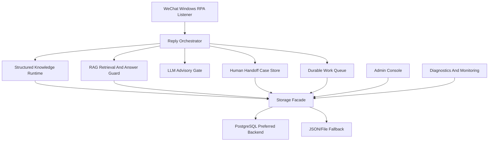

# WeChat AI Customer Service Enterprise Hardening Plan

## 1. Goal

This plan upgrades the WeChat AI customer-service app from a capable local RPA assistant into a more production-shaped customer-service system while preserving the current OmniAuto-first architecture.

The upgrade must keep these principles:

- OmniAuto remains the base automation platform.
- The WeChat customer-service app remains isolated under `apps/wechat_ai_customer_service/`.
- Structured knowledge stays authoritative for deterministic business answers.
- RAG remains auxiliary evidence and style/context support, not an independent business authority.
- PostgreSQL becomes the preferred durable backend, while JSON/file mode remains a safe fallback during migration.
- Human takeover is a first-class workflow, not just a reply template.

## 2. Current Strengths

- The app can operate personal WeChat through the Windows client, which traditional API-first systems cannot do.
- Knowledge is already separated into global, tenant, and product-scoped layers.
- The admin console supports upload, AI-assisted candidate generation, candidate review, diagnostics, backups, and RAG experience review.
- The runtime has guarded reply logic, rate limits, data capture, handoff gates, RAG answer guardrails, and live File Transfer Assistant regression tests.
- PostgreSQL schema, migration tooling, and storage hooks already exist and can run with a local DSN.

## 3. Remaining Enterprise Gaps

### 3.1 Durable Runtime Work Queue

The current listener executes most steps inline. For small test usage this is fine, but production-like use needs durable jobs so long operations do not make the UI or listener look stuck.

Required capabilities:

- Create jobs for long-running actions such as upload learning, RAG rebuild, diagnostics, and future ERP form filling.
- Track job status: `pending`, `running`, `succeeded`, `failed`, `cancelled`.
- Store attempts, error summaries, timestamps, and payload.
- Expose job status through APIs and system status.
- Keep a JSON fallback queue for non-PostgreSQL mode.

### 3.2 Human Handoff Case Store

The current workflow records handoff in target state and JSONL alerts. This should be upgraded into a queryable case store.

Required capabilities:

- Create one durable handoff case when a customer request exceeds automatic authority.
- Preserve customer target, message ids, raw text, reason, suggested reply, risk flags, and product context.
- Support case status: `open`, `acknowledged`, `resolved`, `ignored`.
- Expose open counts and recent cases in the admin API.
- Preserve current WeChat acknowledgement behavior.

### 3.3 Monitoring And Operational Health

The app needs clearer operational health signals beyond raw structured data.

Required capabilities:

- Runtime heartbeat for components such as listener, admin backend, RAG indexer, and job worker.
- System status should report storage mode, PostgreSQL connectivity, queue backlog, open handoff count, recent failures, RAG index size, and knowledge counts.
- Add a preflight-style enterprise readiness report for local delivery checks.

### 3.4 RAG Retrieval Quality Upgrade

The current RAG layer uses hybrid lexical/semantic heuristics. It should become vector-ready without adding a heavy external vector database yet.

Required capabilities:

- Add deterministic lightweight vector features for chunks, stored in the existing PostgreSQL/JSON index.
- Score retrieval with lexical overlap, semantic expansion, source/category boosts, risk penalties, product rerank, and vector cosine.
- Keep RAG guardrails unchanged: RAG cannot authorize prices, discounts, payment terms, after-sales commitments, contracts, compensation, or shipping promises.
- Add boundary tests proving RAG helps with soft context and human-like replies without inventing business decisions.

### 3.5 PostgreSQL Migration Verification

The previous migration foundation was blocked by the lack of a database service. This phase must finish DB-mode verification.

Required capabilities:

- Provide a reproducible local PostgreSQL development setup.
- Initialize schema and migrate existing file data.
- Run storage roundtrip and parity checks.
- Run full regression in `WECHAT_STORAGE_BACKEND=postgres`.
- Run focused File Transfer Assistant live regression in PostgreSQL mode.

## 4. Non-Goals For This Round

- Do not remove JSON/file fallback.
- Do not replace personal WeChat RPA with Enterprise WeChat APIs.
- Do not introduce paid external vector databases.
- Do not implement multi-account scheduling beyond data structures and monitoring hooks.
- Do not migrate raw binary upload contents into PostgreSQL; metadata goes to DB, files remain on disk.

## 5. Architecture Target

## 6. Delivery Phases

1. Local PostgreSQL environment and DB migration verification.
2. Documentation and implementation boundaries.
3. Durable work queue and job status APIs.
4. Handoff case store and admin/system visibility.
5. Monitoring/heartbeat/status readiness APIs.
6. RAG vector-ready retrieval enhancement.
7. Full regression, PostgreSQL-mode regression, and focused live self-test.

## 7. Acceptance Criteria

- PostgreSQL local development instance is runnable without registering a Windows service.
- Existing file knowledge can be imported into PostgreSQL and queried by runtime/admin/RAG paths.
- Work queue can create, claim, complete, fail, and summarize jobs in PostgreSQL and JSON fallback mode.
- Handoff cases are created for runtime handoff events and visible in system status.
- System status reports health in user-facing terms, not raw internal JSON.
- RAG retrieval still passes all existing safety tests and adds vector-similarity evidence to audit details.
- All relevant static checks and full regression suites pass.
- Focused File Transfer Assistant live regression passes in PostgreSQL mode.

