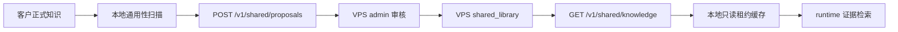

# 共享公共知识云端权威租约改造开发文档

> 更新日期：2026-05-05

## 1. 目标

共享公共知识库以 VPS 云端 `shared_library` 为唯一正式来源。本地客户客户端不再保留可独立演进的“共享公共知识库”，只保留一个由云端下发、带有效期的只读运行缓存包，用来降低频繁请求服务器的成本。

本地缓存不是正式库，也不是长期离线授权。客户端必须按服务端下发的租约规则刷新缓存；租约过期后，本地 runtime 不再把共享公共知识缓存加入知识检索 roots，只继续使用客户自己的正式知识和商品专属知识。

## 2. 端到端工作流



1. 客户正式知识发生新增、更新或周期扫描时，本地只筛选“可能适合共享”的候选。
2. 候选直接提交到 VPS `/v1/shared/proposals`，不经过本地共享公共知识库。
3. VPS admin 在云端审核。只有审核通过后，内容才进入 VPS `shared_library`。
4. 客户端通过 `/api/sync/shared/cloud-snapshot` 拉取 VPS `/v1/shared/knowledge`。
5. 客户端把快照物化到 `runtime/apps/wechat_ai_customer_service/cache/shared_knowledge/`。
6. runtime 只在缓存租约有效时读取该目录。

## 3. 租约缓存契约

VPS `/v1/shared/knowledge` 的 `snapshot` 必须包含：

```json
{
  "source": "cloud_official_shared_library",
  "version": "shared_...",
  "ttl_seconds": 1800,
  "refresh_after_seconds": 300,
  "issued_at": "2026-05-05T00:00:00+00:00",
  "refresh_after_at": "2026-05-05T00:05:00+00:00",
  "expires_at": "2026-05-05T00:30:00+00:00",
  "lease_id": "shared_lease_...",
  "cache_policy": {
    "mode": "cloud_authoritative_lease",
    "requires_cloud_refresh": true
  }
}
```

客户端规则：

- 只有 `source == "cloud_official_shared_library"` 且 `expires_at` 未过期，缓存才参与 runtime 检索。
- `not_modified` 响应也必须带新的租约字段，客户端收到后续写 `snapshot.json`，用于续租。
- `refresh_after_seconds` 控制客户端下一次后台刷新节奏；前端会把刷新间隔限制在 1 到 10 分钟之间，避免过度请求或过久不续租。
- VPS 未配置或请求失败时，本地可以继续保留缓存文件，但只有未过期缓存会被 runtime 使用。
- 过期缓存不会被删除，但会从 `runtime_knowledge_roots()` 中排除。

服务端可配置：

```powershell
$env:WECHAT_SHARED_SNAPSHOT_TTL_SECONDS="1800"
$env:WECHAT_SHARED_SNAPSHOT_REFRESH_AFTER_SECONDS="300"
```

## 4. 本地双端口测试模式

测试环境用两个端口模拟 VPS 服务端和客户客户端：

```powershell
.\.venv\Scripts\python.exe -m uvicorn apps.wechat_ai_customer_service.vps_admin.app:app --host 127.0.0.1 --port 8766
$env:WECHAT_VPS_BASE_URL="http://127.0.0.1:8766"
$env:WECHAT_VPS_AUTO_DISCOVER="0"
.\.venv\Scripts\python.exe -m uvicorn apps.wechat_ai_customer_service.admin_backend.app:app --host 127.0.0.1 --port 8765
```

自动化验收脚本：

```powershell
.\.venv\Scripts\python.exe apps\wechat_ai_customer_service\tests\run_vps_local_two_port_shared_sync_checks.py
```

该脚本会：

- 临时启动 VPS 控制面和本地客户控制台两个 HTTP 服务。
- 在 VPS 状态里写入一条正式共享知识。
- 通过本地客户端注册 node。
- 通过本地 `/api/sync/shared/cloud-snapshot` 拉取云端快照。
- 验证本地只读缓存、租约字段、`not_modified` 续租和 runtime roots。

## 5. VPS 公网部署模式

正式 VPS 部署后，服务端建议监听内网或本机端口，再由 Nginx/Caddy 反代 HTTPS：

```powershell
.\.venv\Scripts\python.exe -m uvicorn apps.wechat_ai_customer_service.vps_admin.app:app --host 0.0.0.0 --port 8766
```

客户客户端配置：

```powershell
$env:WECHAT_VPS_BASE_URL="https://your-domain.example"
$env:WECHAT_VPS_AUTO_DISCOVER="0"
```

临时测试也可以使用公网 IP：

```powershell
$env:WECHAT_VPS_BASE_URL="http://<VPS_PUBLIC_IP>:8766"
```

生产建议：

- 使用 HTTPS 域名优先于裸 IP。
- 设置 `WECHAT_VPS_NODE_ENROLLMENT_TOKEN`，限制未知客户机注册本地 node。
- 客户端保留 `WECHAT_VPS_AUTO_DISCOVER=0`，明确连接正式 VPS。
- 保持防火墙只开放反代端口或必要服务端口。

## 6. 验收标准

- 本地客户控制台没有“共享公共知识库”管理入口。
- 客户正式知识只生成云端 proposal，不写本地共享正式库。
- VPS admin 审核通过后，`/v1/shared/knowledge` 才下发正式共享快照。
- 本地只写 `runtime/.../cache/shared_knowledge`，不写 `data/shared_knowledge`。
- 缓存过期后，runtime 不再使用共享公共知识缓存。
- `not_modified` 可以续租本地缓存。
- 双端口联调和全量测试通过。
