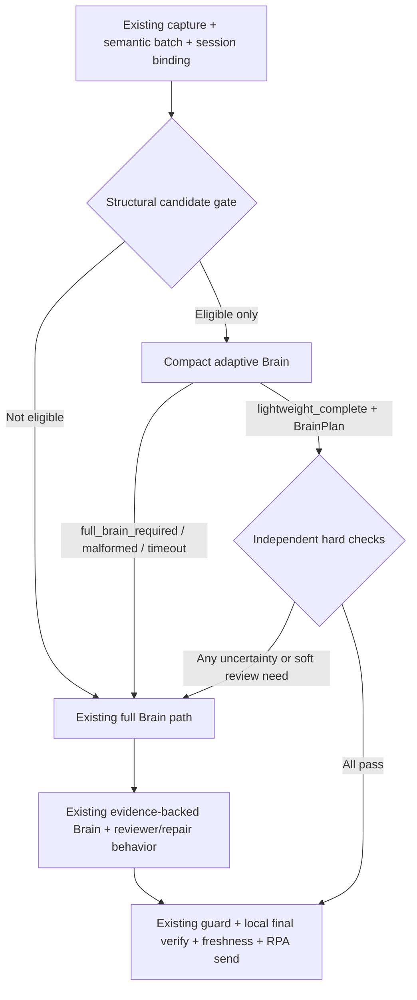

# Brain Adaptive Lightweight Reply Plan And Audit

> **Status (2026-07-13): archived design reserve only. Do not implement, enable, alter runtime logic, change configuration, or run live routing from this document until the repository owner explicitly reopens the work.**

## 1. Baselines And Decision

This document is governed by:

- [customer_visible_reply_ownership_baseline.md](customer_visible_reply_ownership_baseline.md)
- [customer_service_external_contract_and_optional_plugin_baseline.md](customer_service_external_contract_and_optional_plugin_baseline.md)

Decision: introduce an internal, opt-in `customer_service_brain` adaptive lightweight execution profile. It is not a local reply route, a response template, an RPA shortcut, or a new scheduler layer. The Brain remains the only author of customer-visible wording.

The profile is intended for genuinely low-risk social turns. It lets a compact Brain call decide whether it can safely complete the turn in one call. Any uncertainty or failed verification returns to the existing full Brain path. Safety takes precedence over latency.

## 2. Observed Problem

The 2026-07-13 file-transfer self-test sent a greeting and received a short Brain reply. The audit showed:

- first Brain call: 12.5941 seconds;
- Brain quality-repair call: 11.5434 seconds;
- final visible polish: local verification only, 0.0005 seconds;
- final reply RPA send: 8.6357 seconds.

The current `low_authority_fast_profile` did not apply because the regression runner appended its marker as another visible message. The combined input was 45 normalized characters, while the existing profile allows at most 40 and one message. This is a test-shape limitation, not evidence that a real customer greeting cannot use a lightweight path.

The historical short-social condition is also insufficient. `text_evidence_gap_social_only_turn` only skips an evidence-gap preflight; it does not choose the Brain execution profile and it does not prevent a later repair LLM call. Its punctuation-stripped length check is currently six characters, not a safe general semantic decision.

## 3. Goals

1. Let the Brain decide, from the current turn and minimal safe context, whether a response is a self-contained low-risk social reply or requires the full evidence-backed Brain path.
2. For accepted low-risk turns, use one compact Brain invocation plus existing deterministic, guard, freshness, target-binding, and local final-visibility checks.
3. Preserve the complete current Brain, evidence, semantic-review, and repair path for product, policy, price, financing, appointment, trade-in, image, voice, contextual, ambiguous, and uncertain turns.
4. Fail closed: model timeout, malformed output, route ambiguity, or any check failure must never send a local fallback. The runtime must use the full Brain path or block and hand off according to the existing hard-boundary contract.
5. Preserve every external contract, existing import path, function signature, state shape, route, event name, and customer-visible ownership rule. New configuration and audit data are additive and opt-in only.

## 4. Non-Goals

- Do not add a hard-coded greeting/short-answer template.
- Do not use a seven-character, keyword, regex, or vehicle-name list as the final semantic route decision.
- Do not bypass Brain, product authority, formal knowledge, guards, final polish, freshness checks, or send-target confirmation.
- Do not modify voice, image-understanding, optional-plugin registry, RPA capture, RPA sending, session ledger ownership, or multi-session scheduler behavior.
- Do not enable the new path by changing a global default for third-party consumers.

## 5. Target Flow



The structural candidate gate only limits resource use. It may inspect neutral metadata such as message count, media presence, session binding, and active unresolved context. It must not author a reply or decide that a message is a greeting, product question, or safe business request.

The compact adaptive Brain is the semantic decision-maker. It receives the current normalized turn, relevant interaction/strategy metadata, and an explicit fail-closed instruction. It returns an internal decision object:

```json
{
  "route": "lightweight_complete | full_brain_required",
  "reason_class": "non_business_social | context_needed | authority_needed | uncertainty | safety_boundary",
  "brain_plan": { "...": "only when route is lightweight_complete" }
}
```

This object is private to the Brain implementation. It is not a new public payload, CLI field, API, or plugin contract. When `route=lightweight_complete`, `brain_plan` is normalized through the existing BrainPlan validators and remains the sole source of visible text. When `route=full_brain_required`, its content is never sent and the current full Brain path starts from the original captured input.

The private object must use a closed schema: only the two documented route values are accepted, `lightweight_complete` requires exactly one parseable BrainPlan, and `full_brain_required` must not carry reusable customer-visible text. Unknown keys that affect routing, missing required fields, invalid enum values, oversized output, or mixed route/plan combinations are treated as `full_brain_required`, never as a send authorization.

## 6. Safety Contract For A Single-Pass Reply

The lightweight reply may be sent only if every condition below is true:

1. The compact Brain explicitly selects `lightweight_complete` and returns a parseable BrainPlan.
2. The BrainPlan is non-empty, structurally valid, and has `recommended_action=send_reply`.
3. The plan declares no product, price, inventory, policy, financing, trade-in, appointment, condition, delivery, identity, or commitment fact.
4. The plan does not require authoritative evidence, a previous unanswered business question, an unresolved reference, or image/voice interpretation.
5. The captured batch contains no media turn, no cross-session uncertainty, no target-binding uncertainty, and no active business-follow-up or delay-follow-up state.
6. Existing deterministic quality validation, evidence-boundary validation, safety guard, final local verification, freshness check, and RPA target confirmation all pass.

Any failure has one of two outcomes:

- Hard safety or identity/authority boundary: preserve the existing block and internal handoff behavior.
- Soft uncertainty, parse failure, model timeout, stale context, or non-adoptable compact result: run the existing full Brain path from the original input; no compact reply is sent.

The compact route must not turn a reviewer warning into a customer-visible local fallback. It either returns a valid BrainPlan that passes all hard checks or delegates to the existing full Brain.

## 7. Why This Is Brain-Led Rather Than A New Rule Engine

The current short-message threshold remains useful only as a resource bound. It cannot decide semantic safety because short requests can ask about stock, price, financing, or a referenced vehicle.

The adaptive Brain receives no product catalog or policy material on its compact pass. Its instruction is intentionally asymmetric:

- pure non-business social turn with no necessary context: it may author a concise BrainPlan;
- any business, factual, contextual, media, security, or uncertainty signal: it must choose `full_brain_required`;
- uncertainty is always `full_brain_required`.

The runtime independently verifies the result before allowing a single pass. This gives the model semantic discretion without making the model the sole safety gate.

## 8. Compatibility-Preserving Implementation Plan

### 8.1 Internal Module Boundary

Add a small private helper module under `workflows/`, for example:

```text
workflows/
  customer_service_brain.py
  customer_service_brain_adaptive_lightweight.py
```

The helper contains pure internal functions for candidate preparation, compact-decision parsing, fail-closed validation, and audit summarization. It must not import voice, vision, OCR, clipboard, RPA, optional plugin implementations, or scheduler state.

`customer_service_brain.py` remains the public facade and existing Brain runtime owner. No existing exported symbol, import path, function signature, return key, or default behavior is renamed or removed.

### 8.2 Invocation Rules

1. Keep the existing `low_authority_fast_profile` unchanged for callers that have not opted into adaptive execution.
2. Add an additive `customer_service_brain.adaptive_lightweight_execution_enabled` setting with a default of `false`.
3. Enable the setting only in the intended local tenant/configuration after contract, simulation, and live acceptance pass.
4. Use existing provider, model-tier, timeout, and failover infrastructure. No new provider or model credential is required.
   A lower-latency model may be selected only when an existing explicit, tenant-scoped model configuration already names it and it has passed the same BrainPlan safety acceptance suite. Otherwise compact mode uses the currently approved Brain model; it must not silently downgrade model capability for speed.
5. The compact Brain call is limited to bounded current-turn input and compact output. It never receives the full product/formal evidence pack because it is not allowed to answer evidence-bound questions.
6. If the compact Brain chooses the full route, start the full Brain once using the unmodified original batch, existing evidence pack construction, and existing reviewer/repair behavior.

### 8.3 Full-Path Preservation

The following remain unchanged for `full_brain_required` and all non-candidate turns:

- product-master/formal-knowledge retrieval and authority priority;
- image and voice compatibility enrichment already present in the message context;
- BrainPlan generation and Brain-owned repair;
- semantic reviewer, quality repair, guard repair, final visible polish, and handoff behavior;
- session freshness, target binding, RPA send confirmation, and multi-session isolation.

### 8.4 Audit Additions

Add optional fields only under the existing internal `customer_service_brain` audit payload. Existing fields retain their exact meaning.

```json
{
  "adaptive_lightweight": {
    "enabled": true,
    "candidate": true,
    "route": "lightweight_complete | full_brain_required | full_brain_fallback",
    "reason_class": "...",
    "fallback_reason": "...",
    "compact_brain_duration_seconds": 0,
    "full_brain_started": false,
    "repair_llm_started": false,
    "hard_checks_passed": false
  },
  "initial_quality_snapshot": {
    "source": "deterministic | semantic_reviewer | compact_hard_check",
    "ok": false,
    "errors": [],
    "warnings": []
  }
}
```

`initial_quality_snapshot` fixes the present observability gap: an audit that later overwrites `quality_verification` with a repaired success must still retain the original trigger for repair. It contains category/reason data only, not hidden prompts, credentials, or new customer-visible content.

## 9. Required Test Matrix

### 9.1 Lightweight Success

- Single greeting and casual social probe: one compact Brain call, zero repair call, Brain-owned reply, local final verification, normal send.
- Consecutive short social fragments that the compact Brain itself recognizes as one social event: one compact call only when there is no business/delay context.
- Existing `low_authority_fast_profile` remains unchanged when the new feature flag is off.

### 9.2 Mandatory Full Brain

- Short vehicle question such as a model/stock/price/finance/condition query.
- Short acknowledgement after a pending product or price question.
- Image turn, voice turn, image-plus-text turn, or a message that refers to a media asset.
- Appointment, trade-in, after-sales, policy, identity, prompt-injection, personal-data, URL, number, or discount boundary.
- Ambiguous compact-Brain decision, malformed JSON, timeout, provider failure, or unsupported route value.
- Multi-session, session-key, target-title, freshness, and cross-send safety cases.

### 9.3 Fail-Closed And Ownership

- Compact Brain may never produce a local template, guard wording, or legacy fallback.
- Compact result that fails any hard check must not be sent; it must use full Brain or existing hard-boundary handoff.
- Full Brain failure after compact fallback retains the current Brain First block/handoff behavior.
- Voice/image optional-plugin matrix remains unchanged; neither implementation is imported by the adaptive Brain helper.

### 9.4 Contract And Performance

- Existing old import paths, function signatures, JSON fields, state files, and default configuration behavior pass characterization tests unchanged.
- Additive audit fields are absent or ignored safely by old consumers.
- Assert call counts: lightweight success uses one Brain LLM and zero reviewer/repair LLM; full route preserves current call sequence.
- Reject malformed, oversized, unknown-route, route/plan-mixed, and prompt-injected compact-decision payloads into the full Brain path.
- Verify that a production customer message is never stripped, rewritten, or classified as safe because it resembles a test marker. Synthetic-marker handling is test-observability metadata only.
- Record compact Brain, full Brain, repair, final polish, RPA payload, and verification durations separately. Do not claim a latency gain without comparable same-provider, same-message acceptance samples.

## 10. Rollout And Rollback

1. Land pure unit/contract tests with the feature disabled by default.
2. Run local cloud simulation, Brain First static audit, contract checks, scheduler/multi-session checks, and optional-plugin matrix.
3. Enable only for the designated tenant in controlled File Transfer Assistant self-test.
4. Run separate real short-social, short-product, image-plus-text, voice, and two-session no-cross-send acceptance cases.
5. If any unexpected route, quality failure, or cross-session issue occurs, set the additive feature flag to `false`. The runtime immediately returns to the unchanged full Brain path; no migration or state rewrite is required.

## 11. Pre-Implementation Audit

| Audit Area | Result | Required Control |
| --- | --- | --- |
| Customer-visible ownership | Pass with control | Only compact BrainPlan or existing full/repaired BrainPlan may provide text. |
| Hard safety | Pass with control | Any uncertain compact decision falls back to full Brain; hard boundary blocks/handoffs. |
| Product/policy authority | Pass with control | Compact mode has no authority evidence and must delegate all authority-bound turns. |
| Context correctness | Pass with control | Active business, delay-follow-up, media reference, or unresolved context excludes single-pass send. |
| Seven-character overreach | Resolved by design | Length is only a bounded candidate budget; Brain makes the semantic route decision. |
| Double-LLM latency | Addressed safely | Single pass is possible only after compact Brain plus independent hard checks; repair remains available on failure/full path. |
| Multi-session safety | Pass with control | No scheduler or target-binding logic changes; existing freshness/target checks remain mandatory. |
| Voice/vision isolation | Pass | Adaptive helper has no optional-plugin implementation imports or lifecycle changes. |
| External contracts | Pass with control | Feature flag and audit data are additive, opt-in, and default-off; existing APIs/fields/paths remain unchanged. |
| Observability | Finding to fix | Preserve initial quality/reviewer failure reason before any repaired value overwrites it. |
| Test realism | Finding to fix | Regression markers must be distinguishable in test-only routing metrics so they do not falsely diagnose real greeting eligibility. |

No critical design blocker was found. The two audit findings are mandatory acceptance requirements, not optional polish: without them, a later latency regression cannot be correctly attributed to routing, reviewer escalation, model time, or RPA time.

## 12. Approval Boundary

This document authorizes no implementation by itself. Before code changes, retain the default-off compatibility behavior, add characterization tests first, and confirm the exact compact Brain response schema is private to the Brain implementation. Any proposal to rename existing settings, change default behavior for all tenants, add a local reply template, or bypass a hard safety control requires a separate owner-approved migration.
