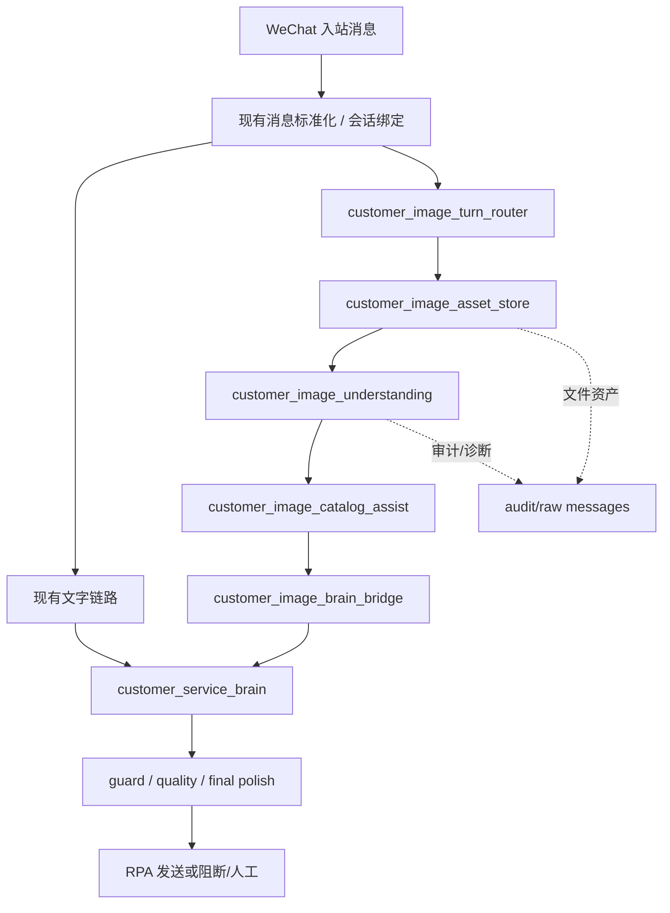

> Customer-service development baseline: [../customer_visible_reply_ownership_baseline.md](../customer_visible_reply_ownership_baseline.md).

# 微信智能客服识图需求与架构

## 1. 目标

给微信智能客服增加“客户发图”理解能力，覆盖以下业务目标：

- 客户只发图片时，识别图片是不是车，以及可能是什么车。
- 客户发图片并带文字时，把图片线索和文字一起理解，判断真实意图。
- 如果客户是在问“商品库里有没有这款车”，则优先对照商品库。
- 如果商品库没有完全同款，则给相似推荐。
- 如果图片和车无关，则进入普通聊天模式，但回复仍由 Brain 产出。

## 2. 硬边界

- `customer_service_brain` 仍然是唯一客户可见回复作者。
- 除“图片入口路由”与“Brain 最小桥接参数”外，不改现有主结构。
- 识图模块只能产出结构化证据、风险、置信度、候选查询和审计信息，不能直接生成客户可见话术。
- 图片识别失败时，不允许本地模板直接给客户发“安全兜底文案”代替 Brain。
- 图片 OCR、视觉摘要、车型猜测不得直接写回普通 `history_text/current_batch_text`，避免污染文字上下文和学习链路。
- 商品事实、价格、库存、政策边界仍必须回到 `product_master` / `formal_knowledge` 授权。
- 不重命名现有变量、CLI、路由、JSON 字段、公开函数名和数据契约。
- V1 不把现有 `reply_evidence_builder.py`、`wechat_message_envelope.py`、history 组装逻辑改造成多模态中心。

## 3. 为什么选“专用识图模块 -> Brain”

不选“直接把图片塞进 Brain”的主要原因：

- 当前 Brain 输入、Prompt、LLM 适配和历史上下文都是纯文本中心，直接改成多模态会扩散到更多核心路径。
- 识图模型和 Brain 模型很可能不是同一类最优模型。识图更适合单独接快模型或专门多模态模型，例如豆包。
- 单独模块更容易做超时、降级、重试和审计，不会拖慢 Brain 的主思考链路。
- 单独模块更利于将视觉识别结果做结构化压缩，避免把大段视觉噪声直接塞进 Brain Prompt。
- 更符合 `AlchemyOS` 已验证过的“文本主脑和多模态模型分路”实践。

## 4. 目标架构

## 5. 模块职责

### 5.1 `customer_image_asset_store`

职责：

- 从当前会话捕获客户图片相关资产。
- 为每张图生成稳定 `asset_id`，并绑定 `conversation_id / message_id / session_key`。
- 保存必要的本地文件，例如 `thumbnail / bubble_crop / turn_capture`。
- 记录尺寸、路径、哈希、采集时间和来源消息。

明确不做：

- 不做客户可见回复。
- 不做车型定论。

### 5.2 `customer_image_understanding`

职责：

- 调用独立多模态模型识别图片内容。
- 结合同轮文字，输出结构化识图结果。
- 给出 `is_vehicle / vehicle_confidence / brand_candidates / series_candidates / normalized_vehicle_query / intent_hints`。
- 输出可审计的 `vision_summary` 和失败原因。

明确不做：

- 不直接决定回复文案。
- 不直接决定“推荐哪台车给客户”。

### 5.3 `customer_image_catalog_assist`

职责：

- 把图片识别结果和客户文字拼成“商品检索查询”。
- 通过独立新模块读取或复用现有商品匹配能力，但不改造现有共享主结构。
- 把视觉识别转换成 `catalog lookup intent`、候选车型、相似推荐方向。

明确不做：

- 不输出客户可见话术。
- 不绕过商品库授权。

### 5.4 `customer_image_brain_bridge`

职责：

- 把识图结果、商品辅助结果和文字 turn 压缩成一个最小 `visual_bridge_input`。
- 通过一个最小内部 API 把该输入传给 Brain。
- 保证该输入是 advisory side input，不改写现有主字段语义。

明确不做：

- 不重写 `BrainInput` 主合同。
- 不改写 `clean_text/history_text/current_batch_text`。

### 5.5 `customer_service_brain`

职责不变，但只增加一个最小可选内部桥接参数：

- 读取当前轮文字。
- 读取可选 `visual_bridge_input`。
- 读取商品库和正式知识证据。
- 最终决定是“库存答复 / 相似推荐 / 普通聊天 / 追问澄清 / 转人工”。

## 6. turn 处理规则

### 6.1 纯文字消息

- 走现有路径，保持不变。

### 6.2 图片 + 文字

- 先识图，再和文字合并做意图判断。
- 如果文字已经明确是“这款有吗 / 多少钱 / 有没有类似的”，则优先做商品识别和商品库匹配。

### 6.3 只有图片

- 如果识图高置信度判断是车，则走“车型识别 -> 商品库匹配 -> 相似推荐”。
- 如果识图高置信度判断不是车，则作为普通聊天素材，由 Brain 基于视觉摘要回复。
- 如果识图低置信度，则由 Brain 追问澄清，不让本地规则直接产出固定话术。

### 6.4 多张图片

V1 建议规则：

- 同一轮最多分析 3 张最新客户图片。
- 优先分析最新一张，其他图片只作为补充证据。
- 如果多张图结论冲突，Brain 应追问，而不是本地模块强行合并。

### 6.5 后续跟进文本

为支持“这款呢 / 这台有吗 / 这车多少”这类追问：

- 识图结果可写入独立 `visual_context_state`。
- 只允许在同一会话内短时复用。
- 只作为“指代解析”上下文，不作为商品事实授权来源。

## 7. 与现有 visual OCR 规则的关系

当前仓库里 `visual_ocr_non_text` 的设计目标是“防止图像上的 OCR 文本污染文字 history 和学习链路”。这条边界必须保留。

新方案不是撤销这条规则，而是增加一条独立视觉通道：

- 文字 history 继续排除图片 OCR 噪声。
- 视觉图片通过 `customer_image_understanding` 进入独立 `vision evidence` 通道。
- Brain 同时看到“文字上下文”和“视觉辅助包”，但两者不混写，也不要求重写现有 history 结构。

## 8. provider 策略

建议把识图 provider 从 Brain provider 独立出来：

- Brain 可以继续用当前配置的 OpenAI / Kimi / DeepSeek。
- 识图模块默认走豆包或其他多模态模型。
- 识图 provider 必须有独立 `api_key/base_url/model/request_style/timeout`。

推荐默认策略：

- 文本 Brain：沿用现有 `customer_service_brain` 配置。
- 图片识图：新增 `customer_image_understanding` 独立配置。
- 请求风格：支持 `anthropic_messages_vision` 或 `openai_chat_vision`。

## 9. 失败与降级策略

### 9.1 识图失败，但文字足够明确

- 继续走文字链路。
- 在审计中记录 `image_understanding_failed_but_text_path_used`。

### 9.2 识图失败，且客户只有图片或文字不足

- 不由识图模块直接回复。
- 由 Brain 基于失败提示决定是否让客户补充车型名、再发清晰图片，或直接进入人工。

### 9.3 商品库无完全匹配

- 由 `visual_to_catalog_bridge` 给出相似候选。
- 由 Brain 选择是否直接推荐、如何表达差距和是否先说明“不是完全同款”。

## 10. 阶段建议

### Phase A

- 打通图片资产采集。
- 打通独立识图 provider。
- 输出结构化识图 JSON。

### Phase B

- 打通 `customer_image_catalog_assist`。
- 将识图结果接入独立 `visual_bridge_input`，再传给 Brain。

### Phase C

- 打通多图、后续追问、会话级视觉上下文。
- 增强审计和 live 验收。

## 11. 本方案的 go / no-go 判定

可以开工的前提：

- 识图模块不写客户话术。
- 视觉结果不污染 `history_text/current_batch_text`。
- 识图 provider 与 Brain provider 完全解耦。
- 旧代码改动范围被控制在最小桥接面内。
- 低置信度和失败场景有 Brain 接管策略。
- 商品事实仍只来源于 `product_master/formal_knowledge`。
