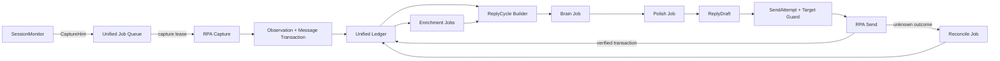

# 微信客服统一消息账本与调度架构审计

日期：2026-07-13

本文引用并服从 [customer_visible_reply_ownership_baseline.md](customer_visible_reply_ownership_baseline.md)。统一账本与调度器属于代码机制层，只负责消息事实、会话归属、工作调度、发送提交和故障恢复。客户可见回复仍只能由 `customer_service_brain` 创作，账本、调度器、守卫和恢复器都不得生成客户可见话术。

## 实施边界更正

本文同时服从 [customer_service_external_contract_and_optional_plugin_baseline.md](customer_service_external_contract_and_optional_plugin_baseline.md)。

仓库已经被外部开发者引用。本文提出的 SQLite、统一 Job、字段替换和旧状态面下线等内容，只保留为长期风险分析和未来可选目标，不是当前获批实施方案。

当前实施必须遵守：

1. 不改变对外变量名、导入路径、接口、函数签名、返回字段、配置、状态字段和出口语义。
2. 不替换现有 scheduler、ledger、Brain bridge 和 RPA 主框架。
3. 使用兼容门面保留原入口，只在内部拆分、收拢和清理。
4. 语音和识图是两个严格独立、可分别缺席或被第三方替换的可选插件域。
5. 当前可执行路线以新的合同与插件隔离基线为准；本文后续大框架迁移章节不得直接用于落代码。

当前获批边界下的具体优化和减负顺序，见 [customer_service_contract_preserving_optimization_and_slimming_audit_20260713.md](customer_service_contract_preserving_optimization_and_slimming_audit_20260713.md)。

## 1. 审计结论

当前系统已经具备会话账本、`session_key`、多会话调度、消息 envelope、媒体识别、发送前 freshness 和发送守卫等必要零件，但这些零件是在迭代中逐层增加的，没有围绕一个统一事务模型建设。

当前不是“一个账本驱动调度”，而是以下六套状态同时参与运行：

1. `SessionMonitor` 的会话列表观察状态。
2. `customer_service_scheduler_state.json` 的 session、capture、LLM task、polish task、ready reply 状态。
3. `listen_and_reply` 的 workflow target state，包括 processed ids、content keys、conversation context 和 sent replies。
4. `SessionLedgerStore` 的 `events.jsonl + summary.json`。
5. `RawMessageStore` 的 conversations、messages、batches 文件或 PostgreSQL 镜像。
6. customer-service audit JSONL。

它们之间通过复制字段、兼容回填、摘要合并和失败吞掉来保持大致一致。这是近期重复出现会话切换、消息去重、旧图重放、短消息误判、发送失败后沉默等问题的共同结构性原因。

正确方向不是继续补更多去重条件，而是建立一个统一的、事务化的消息账本，并让调度器只从账本派生工作。

## 2. 审计边界

本次审计覆盖：

- 会话身份和会话绑定。
- 客户与我方的文字、语音、图片消息入账。
- OCR/RPA 观察与真实消息发生的区分。
- 消息去重和相同内容重复发送。
- 媒体转写、识图等延迟增强。
- 待回复责任、Brain、polish 和发送调度。
- 多会话并发、重启恢复、发送结果不确定性。
- 上下文和 processed 状态的归属。
- 状态持久化、增长、审计和测试。

本次不修改 Brain 的回复策略、商品库、正式知识、识图模型、语音识别方式或 RPA 动作实现。

## 3. 必须先承认的物理边界

在纯微信 UI + OCR/RPA 模式下，系统无法对“程序从未看见、且在首次采集前已经滚出可见区域”的消息作绝对保证。真正的全量无遗漏只能依赖微信官方消息接口、数据库或完整聊天导出。

本方案能提供的硬保证是：

1. 任何被 SessionMonitor、RPA 或 OCR 观察到的消息，不会在系统内部被静默丢弃。
2. 一旦识别为消息 occurrence，就必须以完整固定 schema 原子入账。
3. 同一消息的重复截图只增加 observation，不重复增加 message。
4. 相同内容在不同时间再次发送，只要有新的发生证据，就建立新的 message occurrence。
5. 每个需要回复的客户消息区间，都必须存在一个未结算 reply cycle，直到 AI 已发送、人工已回复、明确无需回复、硬安全阻断或转人工闭环。

## 4. 从零设计的理想模型

### 4.1 一个事实源

每个租户、微信账号使用一个本地 SQLite 数据库：

`runtime/apps/wechat_ai_customer_service/tenants/{tenant_id}/customer_service/runtime_ledger.sqlite3`

建议启用：

- WAL journal。
- foreign keys。
- busy timeout。
- 每次状态转换使用显式 transaction。
- 数据库 schema migration 版本。

SQLite 是当前单机 Windows RPA 场景下最简洁的选择。它同时解决 JSON 全文件重写、跨文件原子性、索引查询、并发读取、崩溃恢复和状态增长问题。未来需要多节点时，可以保持 repository 接口不变，再迁移 PostgreSQL。

### 4.2 八个核心对象

#### Conversation

一个真实微信会话。显示名只能展示，不能当主键。

必备字段：

- `tenant_id`
- `account_id`
- `conversation_id`
- `legacy_session_key`
- `platform`
- `conversation_type`
- `display_name`
- `chat_title`
- `binding_state`
- `binding_fingerprint`
- `last_ledger_seq`
- `last_inbound_seq`
- `handled_through_seq`
- `context_version`
- `created_at`
- `updated_at`

`binding_state` 只能是：

- `confirmed`
- `provisional`
- `ambiguous`
- `retired`

如果微信不给稳定 ID，第一次确认会话行时生成不可变的本地 `conversation_id`，再把会话行指纹绑定到该 ID。后续名称或类型变化只能更新属性，不能重新生成 ID，也不能按名称自动合并两个 ID。

#### Observation

一次程序对微信 UI 的观察，例如会话列表扫描、聊天截图、OCR 读取或媒体保存。

Observation 每次都可以不同，它不等于一条新消息。

必备字段：

- `observation_id`
- `conversation_id`
- `capture_run_id`
- `source_adapter`
- `observed_at`
- `active_window_identity`
- `session_row_fingerprint`
- `pending_hint_id`
- `screenshot_ref`
- `raw_payload_ref`
- `identity_confirmed`

#### Message

一条真实发生的微信消息 occurrence。每条消息只能有一个 `message_id`，但可被多次 observation 看见。

必备字段必须固定存在，不允许不同模块随意省略：

```json
{
  "schema_version": 1,
  "tenant_id": "chejin",
  "account_id": "wechat-account-id",
  "conversation_id": "conv_01...",
  "ledger_seq": 184,
  "message_id": "msg_01...",
  "platform_message_id": null,
  "occurrence_key": "occ_...",
  "direction": "inbound",
  "sender_role": "customer",
  "sender_id": null,
  "sender_display_name": "客户名或群成员名",
  "origin": "wechat_rpa",
  "modality": "image",
  "message_type": "image",
  "content_raw": "[图片]",
  "content_text": "白色蔚来 ES6，车辆正面视角",
  "content_state": "enriched",
  "language": "zh-CN",
  "media_asset_id": "asset_...",
  "occurred_at": null,
  "occurred_at_text": "14:03",
  "time_precision": "minute",
  "first_observed_at": "2026-07-13T14:03:05+08:00",
  "last_observed_at": "2026-07-13T14:03:07+08:00",
  "source_adapter": "win32_ocr",
  "source_message_id": null,
  "bubble_id": "bubble_...",
  "sender_confidence": 0.98,
  "content_confidence": 0.92,
  "quality_flags": [],
  "reply_eligible": true,
  "enrichment_state": "complete",
  "handled_state": "pending",
  "causation_id": "hint_...",
  "correlation_id": "cycle_...",
  "created_at": "2026-07-13T14:03:05+08:00",
  "updated_at": "2026-07-13T14:03:07+08:00"
}
```

字段可以是 `null`，但不能不存在。这样才能区分“模块没写字段”和“字段确实未知”。

方向和来源必须分开：

- `direction=inbound`：客户或群成员发给当前账号。
- `direction=outbound`：当前账号发出。
- `origin=human_agent`：人工操作发送。
- `origin=ai_agent`：本程序发送并绑定 `reply_id`。
- `origin=unknown_self`：看到我方气泡，但暂时无法证明是人工还是 AI。

模态必须在第一次观察时就确定。语音和图片即使尚未转写，也要先以 `content_state=pending_enrichment` 入账，不能等到识别成功后才“变成一条消息”。

#### MessageObservation

连接 Message 与 Observation，保存每次看见消息时的视觉证据：

- `observation_id`
- `message_id`
- `bubble_bounds`
- `visual_side`
- `ocr_items_ref`
- `screen_time_text`
- `observation_confidence`
- `match_method`

同一气泡被截图十次，是一个 Message 加十个 MessageObservation，不是十条 Message。

#### MessageEnrichment

保存语音转文字、识图、图片 OCR 等延迟结果，不覆盖原始事实：

- `enrichment_id`
- `message_id`
- `kind`
- `status`
- `provider`
- `model`
- `result_payload`
- `result_text`
- `confidence`
- `version`
- `job_id`
- `created_at`

Message 的 `content_text/content_state` 是最新可用增强结果的投影。完整历史留在 MessageEnrichment。

#### ReplyCycle

ReplyCycle 不是一条消息，而是“系统对一段客户输入负有回复责任”的结算单。

必备字段：

- `cycle_id`
- `conversation_id`
- `input_from_seq`
- `input_to_seq`
- `input_version`
- `input_digest`
- `status`
- `resolution`
- `active_reply_id`
- `created_at`
- `updated_at`

状态建议：

- `waiting_enrichment`
- `debouncing`
- `planning`
- `reviewing`
- `ready_to_send`
- `sending`
- `reconciling`
- `completed`
- `superseded`
- `handoff`
- `blocked`

最终 resolution 只能是：

- `ai_sent`
- `human_replied`
- `no_reply_required`
- `handoff_open`
- `hard_safety_blocked`

`no_reply_required` 只允许用于系统消息、重复 observation、明确非客户输入等机制性场景，不能用于正常客户消息来规避回复。

每个 conversation 同时最多只有一个正在构建回复的活动 ReplyCycle。新客户消息进入时扩展该 cycle 或令旧版本 superseded，不再建立互相竞争的多套 pending 状态。已经发生物理发送但结果未知的旧 cycle 可以留在 `reconciling`，新的客户输入可以建立下一 cycle，但新的 send job 必须等待旧 SendAttempt reconciliation 完成，以保证对话顺序。

#### Job

所有异步工作使用同一种任务结构，不再分别维护 `llm_tasks`、`polish_tasks`、`media_context_tasks` 和 `ready_replies` 四套状态机。

必备字段：

- `job_id`
- `job_type`
- `conversation_id`
- `cycle_id`
- `input_version`
- `dedupe_key`
- `status`
- `priority`
- `available_at`
- `lease_owner`
- `lease_expires_at`
- `attempt_count`
- `max_attempts`
- `payload_ref`
- `result_ref`
- `last_error`
- `created_at`
- `updated_at`

`job_type` 包括：

- `capture`
- `transcribe_voice`
- `understand_image`
- `plan_reply`
- `polish_reply`
- `send_reply`
- `reconcile_send`
- `build_context_summary`

`status` 统一为：

- `queued`
- `leased`
- `retry_wait`
- `succeeded`
- `failed_terminal`
- `cancelled`

Job 使用 lease，而不是依赖进程内 Future 判断是否 orphan。进程重启后，lease 到期即可安全恢复。

#### ReplyDraft 与 SendAttempt

ReplyDraft 保存 Brain 产出的客户可见内容和输入版本：

- `reply_id`
- `cycle_id`
- `brain_owned=true`
- `input_version`
- `input_digest`
- `reply_segments`
- `evidence_digest`
- `status`

SendAttempt 保存不可事务化的微信物理发送过程：

- `send_attempt_id`
- `reply_id`
- `conversation_id`
- `status`
- `target_guard_evidence`
- `started_at`
- `physical_action_at`
- `verified_at`
- `failure_reason`

发送状态必须区分：

- `prepared`
- `physical_action_started`
- `verified`
- `failed_before_action`
- `unknown_outcome`

`unknown_outcome` 不能直接当普通失败重试。系统必须先重新采集目标会话，确认回复文本是否已经出现，再决定完成或重试。

### 4.3 数据库硬约束

关键正确性应由数据库约束保证，而不是只靠 Python if：

- `UNIQUE(conversation_id, ledger_seq)`
- `UNIQUE(conversation_id, occurrence_key)`
- `UNIQUE(observation_id, message_id)`
- `UNIQUE(job_type, dedupe_key)`
- Message、Observation、Job、Cycle、Draft、SendAttempt 全部使用 foreign key。
- direction、modality、content_state、job status、cycle status 使用 `CHECK` 约束。
- 核心归属字段 `tenant_id/account_id/conversation_id/schema_version` 全部 `NOT NULL`。
- 使用 partial unique index 保证每个 conversation 只有一个 reply-building cycle。
- Audit event 保存 `correlation_id + causation_id + entity_type + entity_id`，可以从任意回复追溯到原始 observation。

数据库约束失败应直接回滚事务并保留 job 供重试，不能吞掉后继续下游。

## 5. 身份与幂等规则

### 5.1 会话身份

1. `conversation_id` 是唯一主键。
2. `session_key` 在迁移期作为 alias 保留。
3. `display_name/chat_title` 只用于 UI 和人工查看。
4. `conversation_type` 是属性，不参与后续重新生成主键。
5. 不允许按“同名且当前只看到一个”自动合并会话。
6. 任何 alias 合并必须有明确 binding 证据或人工确认，并写可逆审计事件。

### 5.2 消息 occurrence 身份

优先级：

1. 微信稳定 message ID。
2. 已绑定的 bubble ID。
3. 已有 MessageObservation 与当前气泡的稳定视觉匹配。
4. 来源时间、方向、模态、说话人和气泡位置共同证明的新 occurrence。
5. 证据不足时标记 `identity_ambiguous` 并重采，不使用 `captured_at` 强行制造新消息。

禁止把以下字段单独用于 message occurrence：

- OCR 文本内容。
- 当前截图时间 `captured_at`。
- 会话显示名。
- 图片 SHA。
- 气泡在当前窗口中的绝对 Y 坐标。

图片 SHA 只能表示资产内容相同，不能表示同一条消息。Observation 时间只能表示再次看见，不能表示再次发送。

### 5.3 业务序号

每个 conversation 拥有严格递增 `ledger_seq`。调度判断只使用序号水位：

- `last_inbound_seq`
- `handled_through_seq`
- ReplyCycle 的 `input_from_seq/input_to_seq`

不再用最多 500 个 `processed_message_ids` 和 `processed_content_keys` 列表模拟水位。

## 6. 最简调度算法

### 6.1 唤醒

SessionMonitor 只生成 CaptureHint：

- hint 可以来自未读红点、预览变化、语音/图片标记或人工请求。
- hint 只负责创建或唤醒 `capture` job。
- hint 文本不能进入 Brain，不能直接成为 Message，也不能决定 occurrence ID。
- 同一 conversation 的相同 hint 可以合并，真实 Message 不允许被 hint 合并。

### 6.2 采集入账

全局只允许一个前台 RPA capture/send lease。

采集事务：

1. 按 `conversation_id` 激活会话。
2. 再次确认 active conversation identity。
3. 创建 Observation。
4. 解析所有可见客户和我方消息，包括未转写语音、未识别图片和无法回复的系统消息。
5. 匹配已有 Message 或创建新的 Message occurrence。
6. 写 MessageObservation。
7. 为待转写语音、待识图图片创建 enrichment job。
8. 更新 conversation 水位。
9. 提交事务。

任意一步失败，整个入账事务回滚，capture job 进入 `retry_wait`。不能出现 scheduler 已接受 capture、ledger 却写失败的状态。

### 6.3 回复责任生成

事务提交后，CycleBuilder 查看：

- 是否有 `ledger_seq > handled_through_seq` 的 inbound customer message。
- 这些消息是否已被后续人工 outbound message 覆盖处理。
- 必要媒体增强是否完成。
- 是否已有活动 ReplyCycle。

处理规则：

1. 我方人工消息同样先入账。
2. 如果人工消息发生在客户消息之后，且没有 AI reply 关联，则前一段客户输入结算为 `human_replied`。
3. 仍有未处理客户消息时，创建或扩展唯一活动 ReplyCycle。
4. 语音/图片未增强时状态为 `waiting_enrichment`。
5. 增强完成后创建 `plan_reply` job。

### 6.4 Brain 与 polish

Brain 输入只从账本按序号构建：

- 当前 ReplyCycle 输入区间。
- 此前有限窗口消息。
- `summary_through_seq` 不超过当前账本序号的上下文摘要。
- 商品库和正式知识证据。

`plan_reply` job 绑定 `input_version + input_digest`。Brain 思考期间出现新客户消息时：

1. conversation `context_version` 增加。
2. ReplyCycle `input_version` 增加并扩展区间。
3. 旧 Brain 结果写审计但不能进入 ready 状态。
4. 新版本自动排队，不需要重新从 UI 猜测旧消息。

polish 可以作为同一 Job 模型中的下一任务，但只允许处理 Brain 草稿，不改变 Brain 所有权。

### 6.5 发送

发送前必须同时满足：

1. ReplyDraft 是 Brain-owned。
2. ReplyCycle 仍是当前活动 cycle。
3. `input_version/input_digest` 未变化。
4. 当前 active conversation 与 `conversation_id` 绑定一致。
5. 没有更新的 inbound ledger sequence。

物理发送前，先提交 `SendAttempt(prepared)`。发送后：

- verified：一个事务内写 AI outbound Message、更新 SendAttempt、完成 ReplyCycle、推进 `handled_through_seq`。
- failed before action：按 job backoff 重试。
- unknown outcome：创建 `reconcile_send` job，先读微信确认，不得盲重发。

### 6.6 不沉默守恒条件

对每个未结算 ReplyCycle，数据库必须始终满足以下至少一个条件：

1. 存在 queued/leased/retry_wait Job。
2. 存在 ready ReplyDraft。
3. 存在 unknown_outcome SendAttempt 和 reconcile Job。
4. cycle 已进入 handoff/blocked，并产生明确运营告警。

Watchdog 定期查询违反条件的 orphan cycle，并恢复或告警。这样“不回复”会成为可检测的数据库不变量破坏，而不是散落日志里的偶发现象。

## 7. 当前实现总盘点

### 7.1 实际持久化面

| 状态面 | 当前职责 | 当前问题 |
| --- | --- | --- |
| SessionMonitor state | 未读、预览、优先级、sticky target、重试时间 | 与 scheduler session 重复；无统一事务；hint 和业务状态耦合 |
| Scheduler JSON | sessions、captures、LLM、polish、media、replies、events | 承担实际调度事实，但体积持续增长；不是账本投影 |
| Workflow state | processed ids、content keys、context、sent replies | 与 scheduler/ledger 重复；Brain 前又要合并三方状态 |
| Session Ledger | capture/reply JSONL、summary | 名义事实源，实际是可失败的辅助写；事件和 summary 不原子 |
| RawMessageStore | 原始消息、会话、学习批次 | 另一套消息仓；无 session_key；与调度去重无统一合同 |
| Audit JSONL | 运行审计 | 无 correlation/causation 统一链路，难以还原事务 |

### 7.2 当前 chejin 运行数据证据

审计时的实际文件体量：

- Scheduler state：43,315,817 bytes。
- Workflow state：392,661 bytes。
- SessionMonitor state：6,080 bytes。
- customer-service audit：7,308,531 bytes。
- Session ledger：10 个文件，合计 918,892 bytes。
- Raw messages：4,792,164 bytes。
- Raw batches：1,566,523 bytes。

Scheduler state 当前包含：

- 4 个 session。
- 405 个 capture。
- 267 个 LLM task。
- 196 个 polish task。
- 70 个 ready reply。
- 500 个内嵌 event。

其中 captures、LLM tasks、polish tasks 没有正常历史裁剪，现有 cleanup 主要清理 ready replies 和 media tasks。这解释了 scheduler JSON 已膨胀到 43 MB，且每个 tick 仍需完整 load、deepcopy、indent JSON save。

### 7.3 当前消息字段覆盖证据

Session ledger 的 245 条 recent message 样本中：

- 0 条带 `session_key`。
- 0 条带 `conversation_type`。
- 0 条带 `direction`。
- 0 条带 `occurred_at/observed_at`。
- 0 条带 `schema_version`。
- 0 条带 `ledger_seq`。
- 114 条没有 modality。
- 114 条没有 source_type。
- 25 条 sender 为 unknown。

RawMessageStore 的 642 条消息虽然字段更丰富，但：

- 0 条带 `session_key`。
- 0 条带统一 `schema_version`。
- 0 条带 `direction/modality/ledger_seq/correlation_id`。
- conversation_id 由 `conversation_type + target_name` 派生，不是 scheduler 的真实 session identity。

因此当前无法证明“每条消息都以同一完整结构进入同一本账”。

## 8. 主要差异与问题分级

### P0：Ledger 不是实际事实源

`customer_service_session_ledger.py` 的注释称 ledger 是 local source of truth，但 `record_capture_result()` 先更新 scheduler state，再在 try/except 中写 ledger。ledger 写失败只追加 `scheduler_session_ledger_capture_failed`，capture 仍可进入 Brain 和发送。

结果：

- 可能存在有 Brain task、无 ledger message 的回复。
- 账本无法单独回放恢复运行状态。
- “每条消息必入账”没有硬保证。

应改：消息入账和 cycle/job 生成必须在同一数据库事务内完成，账本写失败时不得继续规划。

### P0：一条消息没有唯一、稳定、全模态的 occurrence 合同

当前同时存在：

- `canonical_input_message_id`
- `canonical_visual_message_id`
- scheduler `message_identity`
- workflow `reply_input_message_identity`
- `ledger_message_content_key`
- scheduler `message_content_key`
- workflow 多套 dedupe/anchor/content key
- RawMessageStore `dedupe_key` 和 fuzzy OCR merge

不同模块对“同一条消息”的定义不同。短消息、图片和普通文字又分别增加特殊规则。

应改：只保留一个 MessageIdentityRepository。Message occurrence 与 Observation 分离，所有模块只消费统一 message_id。

### P0：观察时间与消息发生时间混用

`wechat_message_envelope.apply_message_envelope_to_record()` 对 OCR 消息把 `time/message_time` 改成 `captured_at`。repeatable identity 又把 `captured_at` 当 occurrence fallback。

结果：

- 同一个短气泡再次截图可能被当成新消息。
- 相同内容在不同真实时间再次发送，又可能被旧 content-key 吞掉。
- 当前系统只能靠 pending signal、特殊短句和视觉规则不断修补。

应改：`occurred_at_text`、`occurred_at` 和 `observed_at` 永久分开。captured_at 只能进入 Observation。

### P0：会话身份仍存在按名称自动合并路径

`SessionMonitor._reuse_unique_display_name_session_key()` 会在同名 generated session 中按 recent count/context version 选 canonical，并调用 `merge_session_alias_context()` 合并其它 ledger。该策略没有强制要求 conversation type、row binding 或人工确认一致。

RawMessageStore 也不接收 scheduler session_key，而是按 type + target name 生成 conversation_id。

结果：

- 同名私聊、群聊、历史类型漂移可能被错误合并。
- 发送守卫可以阻止错发，但 Brain 上下文可能已被混入。

应改：会话 ID 一旦建立不可按名字重算。alias 合并必须显式、可审计、可回滚。

### P0：物理发送与持久化提交之间存在不确定窗口

当前先通过 Future 执行微信发送，下一次 collect 才调用 `mark_reply_sent()` 写 scheduler/ledger。进程在微信已发送、状态未提交之间退出时，重启逻辑把 sending reply 标记为 `send_worker_orphaned_after_restart`，没有专门的 unknown outcome reconciliation。

结果：

- 可能实际已发但本地认为失败。
- 后续重新 capture/replan 可能重复回复。
- 也可能长期保留未处理客户输入。

应改：发送前持久化 SendAttempt，重启后先对话内核对结果，再完成或重试。

### P0：不是每条观察到的消息都进入 append-only 账本

Session ledger 的 capture event 主要保存 reply batch，不保存完整 messages。全部 messages 只进入最多 80 条的 summary，之后会被覆盖淘汰。RawMessageStore 又过滤掉没有 content 的消息，并且写失败不会阻止回复流程。

结果：

- 我方消息、系统消息、未转写语音、原始图片气泡可能只有临时 capture 或 summary 副本。
- 无法从 append-only ledger 重建完整会话。

应改：所有 message occurrence 独立持久化，是否进入 Brain 是后续派生字段，不能在入账前过滤。

### P1：六套状态形成多事实源

Scheduler、Workflow 和 Ledger 都保存 processed ids/content keys/context/reply anchors。`ManagedListenerSchedulerBridge` 每次规划前加载 workflow state，再把 scheduler session 和 ledger summary 合并进去；发送后又分别写 workflow state、scheduler state、ledger 和 audit。

结果：

- 任意一步失败都可能产生版本漂移。
- 修复一个状态面不能保证其它状态面一致。
- 同一 bug 会以 capture、freshness、context、send 的不同表现反复出现。

应改：Workflow state 退化为可重建 projection。processed 水位、上下文窗口、pending responsibility 全部从统一账本读取。

### P1：Scheduler JSON 无界增长且每 tick 全量读写

实际 43 MB state 已证明该问题存在。cleanup 没有裁剪 captures、LLM tasks 和 polish tasks，且 task result 内可能重复保存完整 Brain 结果和 trace。

结果：

- tick 的读取、deepcopy、序列化和 replace 时间持续上升。
- 更容易在并发和异常退出时产生长时间锁或状态损坏。
- 排障需要解析巨大 JSON。

应改：活动 Job 放数据库表；终态任务按索引查询并按保留策略归档，不再每 tick 全量加载历史。

### P1：写入不具备跨对象原子性

Session ledger 先 append JSONL，再 load/update/save summary，二者没有共同事务和统一锁。RawMessageStore 文件镜像也是 read-modify-replace。Scheduler runtime 的 tick 直接 load/save，未使用 `SchedulerStateStore.update()` 的跨进程锁。

结果：

- 事件成功、summary 失败。
- summary 被并发旧版本覆盖。
- scheduler 与 admin/其它进程并发更新时存在 lost update。

应改：SQLite transaction 统一完成 message、projection、cycle 和 job 更新。

### P1：Session status 把多个并行维度压成一个字符串

当前 session `status` 在 capturing、llm_running、polish_running、reply_ready、sending、failed、internal_handoff_pending 等值之间覆盖。与此同时真实状态又存在于 tasks/replies 中。

结果：

- session status 很容易与 task 状态不一致。
- 一个会话同时“有 follow-up pending + old reply sending”时无法由单字段准确表达。

应改：Conversation 只保留水位和 active cycle。运行状态由 Job、ReplyCycle、SendAttempt 派生。

### P1：pending signal 被过度赋予消息身份职责

当前 pending_signal_id 既表示一次 scheduler pending window，又会被附着到图片消息并参与 occurrence/freshness。实际 405 个 capture 中没有一个在 capture 顶层固定保存 pending_signal_id，只能从 session 或 batch message 中寻找。

结果：

- hint 生命周期与 message 生命周期耦合。
- 同一图片重复发送、旧图片重复观察和新 pending window 需要大量例外判断。

应改：hint 只作为 causation_id。Message occurrence 由消息证据确定，freshness 由 ledger sequence/version 确定。

### P1：send_failed 是终态，但没有统一责任恢复

`mark_reply_failed()` 把 reply/session 标成失败后结束，不保证创建 retry、reconcile 或 handoff job。Brain 失败虽然有若干专门恢复分支，发送失败却没有一个统一不变量确保继续处理。

应改：任何 unresolved ReplyCycle 必须始终拥有 active job 或 handoff。失败策略由 Job 的 attempts/available_at 统一管理。

### P1：上下文版本定义不完整

当前 `context_version` 主要在新 customer reply candidate 出现时增加。人工 self 消息、媒体 enrichment、conversation context 更新可能改变 Brain 应看到的上下文，却不一定推进同一个版本。

应改：区分：

- `ledger_version`：每个新 Message occurrence 递增。
- `semantic_version`：可用于 Brain 的文本/识图/转写变化时递增。
- `summary_version`：上下文摘要投影版本。
- ReplyCycle `input_version`：只绑定本轮回复区间。

### P2：RawMessageStore 与 SessionLedger 职责重叠

RawMessageStore 的 envelope、OCR evidence、observed_at 比 SessionLedger 更丰富，但它主要服务记录/学习；SessionLedger 服务调度，但字段更少。二者没有统一主键。

应改：统一 Message 表作为运行与记录共同底座。学习模块只订阅允许学习的 message event，不再维护第二份原始消息事实。

### P2：兼容逻辑长期留在热路径

当前热路径仍包含：

- name-only legacy session lookup。
- legacy workflow processed/content-key 去重。
- scheduler-authoritative batch fallback。
- monitor synthetic short preview。
- alias ledger merge。
- 多套 history backfill/overflow anchor。
- legacy `customer_service_loop` 类型和函数依赖。

这些逻辑当初分别解决真实问题，但目前互相叠加。它们不应在新架构中逐条搬迁，只应在迁移 adapter 中保留，并最终删除。

### P2：测试覆盖大量分支，缺少数据库不变量测试

现有 scheduler 测试对具体行为覆盖很广，包括同名会话、短消息、图片、语音、restart、stale、ledger 和 send guard。但缺少以下总合同：

- 所有观察消息必有统一 schema。
- ledger 写失败时不得产生 planner job。
- 任意 unresolved cycle 必有 job/handoff。
- 物理发送后、提交前崩溃可 reconcile。
- 从账本空投影重建后，调度结果一致。
- 同一 observation 重放幂等。
- 多进程写入不丢更新。
- migration 重跑幂等且不合并不同会话。

## 9. 应保留、应替换、应下线

### 保留

- Brain First 所有权合同。
- Win32/OCR sidecar 的消息解析和窗口安全能力。
- `wechat_message_envelope` 中 speaker、quote、OCR evidence 清洗经验。
- `message_identity` 中已有的视觉/发生证据经验，但重写为唯一 identity service。
- 图片资产存储和独立识图模块。
- 语音右键转文字模块。
- 商品库、正式知识和现有 Brain 输入构建能力。
- RPA 全局互斥、目标守卫和拟人动作节奏。

### 替换

- `customer_service_scheduler_state.json` 替换为 SQLite Job/Cycle/Projection。
- `SessionLedgerStore JSONL + summary` 替换为统一 Message/Observation/Enrichment 表。
- workflow processed ids/content keys 替换为 ledger sequence watermarks。
- monitor pending state替换为 CaptureHint/Job。
- ready_replies map 替换为 ReplyDraft + send job。
- orphan Future 恢复替换为 Job lease。

### 迁移后下线

- 按 display name 自动 alias merge。
- 多套 message/content dedupe key。
- synthetic monitor message 进入 Brain 的路径。
- scheduler-to-workflow processed 状态复制。
- RawMessageStore 作为第二消息事实源。
- captures/LLM/polish 的永久内嵌 JSON 历史。

## 10. 渐进改造方案

不建议一次性重写 RPA、Brain 和调度器。建议使用 strangler migration，先建立统一事实源，再逐步切读写权。

### Phase 0：合同冻结与观测

1. 冻结现有字段和公开 API，不重命名现有 route/function。
2. 建立 `UnifiedMessageEnvelopeV1`、Job、Cycle、SendAttempt schema。
3. 增加只读审计工具，对现有 capture/ledger/raw store 做字段覆盖和身份冲突报告。
4. 建立运行时不变量指标，但暂不改变调度。

验收：所有新 schema 有 contract test，旧流程无行为变化。

### Phase 1：SQLite 账本双写

1. 新增独立 `unified_ledger` 模块。
2. capture 成功解析后，将所有 messages/observations/enrichments 双写 SQLite。
3. SQLite 双写失败只告警，旧流程暂时继续，便于灰度比较。
4. 对同一 observation 重放验证幂等。
5. 不做 alias 自动合并。

验收：SQLite 与现有 capture 的消息数、方向、模态和身份差异可解释。

### Phase 2：账本成为消息事实源

1. 调度器的 batch 从 SQLite 未处理 sequence 读取。
2. workflow state 只作为兼容上下文，不再决定 processed。
3. ledger transaction 失败时不创建 planner job。
4. 图片/语音先记录原消息，再异步 enrichment。

验收：删除临时 scheduler state 后，可从 SQLite 重建待处理消息，不重回客户旧消息。

### Phase 3：统一 Job 与 ReplyCycle

1. 把 media、planner、polish、send 迁入 jobs 表。
2. 每会话只保留一个 active ReplyCycle。
3. 加入 lease、retry_wait、dead-letter/handoff。
4. 建立 orphan cycle watchdog。

验收：进程在任意 job 阶段退出，重启后都可恢复且不重复发送。

### Phase 4：发送事务与 reconciliation

1. 物理发送前写 SendAttempt。
2. verified 后原子完成 outbound message、cycle 和 watermark。
3. unknown outcome 必须重新读取微信确认。
4. 删除 `send_worker_orphaned_after_restart -> 普通失败` 的旧路径。

验收：模拟发送后立即 kill，重启不重复回复、不丢失处理责任。

### Phase 5：切断旧事实源

1. Workflow processed/context 改为 SQLite projection。
2. RawMessageStore 改为 ledger 订阅导出，不再写第二份消息主事实。
3. Session Ledger JSONL 变为可选审计导出。
4. Scheduler JSON 只保留迁移备份并停止热路径读写。
5. 删除 alias merge、legacy content-key 和 synthetic message 兼容分支。

验收：运行时只有一个消息事实源、一个 Job 状态机、一个发送提交模型。

### Phase 6：压测与实盘灰度

1. 旧路径 shadow compare。
2. 文件传输助手单会话回放。
3. 许聪 + 新数据测试多会话并发。
4. 客户和我方分别发送同文本、同图片、同语音。
5. Brain 运行中人工插话。
6. RPA capture/send 各阶段 kill/restart。
7. 24 小时稳定性和数据库增长测试。

## 11. 推荐代码清单与内部 API

统一账本仍属于现有代码机制层，不新增业务层级，也不改变 Brain、识图或语音模块的归属。建议新增一个内聚目录：

```text
apps/wechat_ai_customer_service/admin_backend/services/unified_ledger/
  __init__.py
  schema.sql
  migrations.py
  models.py
  repository.py
  identity.py
  ingestion.py
  cycle_builder.py
  job_queue.py
  brain_bridge.py
  send_commit.py
  send_reconciler.py
  legacy_import.py
  invariants.py
  diagnostics.py
```

各文件只承担一种职责：

| 文件 | 职责 |
| --- | --- |
| `schema.sql` | conversations、observations、messages、message_observations、enrichments、reply_cycles、jobs、reply_drafts、send_attempts、audit_events |
| `migrations.py` | schema version 和幂等迁移 |
| `models.py` | 固定 enum/dataclass/TypedDict 合同 |
| `repository.py` | transaction、查询和 projection，不包含业务回复逻辑 |
| `identity.py` | 唯一会话绑定和 message occurrence 匹配 |
| `ingestion.py` | Observation + Message 原子入账 |
| `cycle_builder.py` | 根据 ledger sequence 建立或扩展 ReplyCycle |
| `job_queue.py` | 通用 job lease、retry、complete、cancel |
| `brain_bridge.py` | 从 cycle/ledger 构建 Brain 输入并保存 Brain-owned draft |
| `send_commit.py` | prepare send 和 verified send 原子提交 |
| `send_reconciler.py` | unknown outcome 重读微信确认 |
| `legacy_import.py` | 导入现有 scheduler/workflow/ledger/raw message 数据 |
| `invariants.py` | orphan cycle、identity conflict、watermark 越界检查 |
| `diagnostics.py` | 管理端审计查询和链路复盘 |

### 11.1 最小写 API

```python
record_capture_hint(hint: CaptureHint) -> JobRef

ingest_observation(
    conversation_id: str,
    observation: ObservationInput,
    visible_messages: list[MessageInput],
) -> IngestionResult

complete_enrichment(
    job_id: str,
    message_id: str,
    enrichment: EnrichmentResult,
) -> MessageProjection

claim_jobs(
    worker_id: str,
    job_types: set[str],
    limit: int,
    lease_seconds: int,
) -> list[ClaimedJob]

complete_job(job_id: str, result_ref: str) -> None
retry_job(job_id: str, error: JobError, available_at: str) -> None

store_brain_draft(
    cycle_id: str,
    input_version: int,
    brain_plan: BrainPlan,
) -> ReplyDraft

prepare_send(reply_id: str, guard_evidence: dict) -> SendAttempt

commit_verified_send(
    send_attempt_id: str,
    outbound_message: MessageInput,
    verification: dict,
) -> CommitResult

mark_send_unknown(send_attempt_id: str, evidence: dict) -> JobRef
```

所有写 API 自己开启 transaction，调用方不能直接编辑数据库字段。

### 11.2 最小读 API

```python
get_conversation(conversation_id: str) -> Conversation
get_messages(conversation_id: str, *, from_seq: int, to_seq: int | None) -> list[Message]
get_brain_context(cycle_id: str) -> BrainContext
get_active_cycle(conversation_id: str) -> ReplyCycle | None
get_unresolved_cycles(limit: int) -> list[ReplyCycle]
get_send_attempt(send_attempt_id: str) -> SendAttempt
verify_invariants(conversation_id: str | None = None) -> InvariantReport
```

### 11.3 现有接入点映射

| 当前入口 | 第一阶段接法 | 最终归宿 |
| --- | --- | --- |
| `SessionMonitor.poll/select_dispatch_targets` | 保留扫描，只改为调用 `record_capture_hint` | 轻量 hint producer |
| `ManagedListenerSchedulerBridge._capture_session` | RPA 解析后调用 `ingest_observation` 双写 | capture worker |
| `record_capture_result` | 读取 IngestionResult 做兼容镜像 | 删除，由 ingestion transaction 取代 |
| `SessionLedgerStore.record_capture` | shadow export | 下线或变为 JSONL 导出器 |
| `RawMessageStore.upsert_messages` | 从 unified ledger 订阅导出 | 不再是运行事实源 |
| `enqueue_media_context_task` | 映射到通用 enrichment job | 删除专用 task map |
| `enqueue_llm_task` | 映射到 plan_reply job | 删除专用 task map |
| `enqueue_polish_task` | 映射到 polish_reply job | 删除专用 task map |
| `_enqueue_ready_reply_from_payload` | 写 ReplyDraft + send job | 删除 ready_replies map |
| `_dispatch_send_reply` | 先 `prepare_send` 再执行现有 RPA | send worker |
| `mark_reply_sent` | 改为 `commit_verified_send` | 删除多状态面分别更新 |
| `_recover_orphaned_sending_replies` | 迁移为 unknown outcome reconcile | 删除普通失败恢复 |
| `_merge_scheduler_context_into_workflow_state` | shadow compare ledger context | 最终删除 |
| workflow `mark_processed` | 兼容镜像 ledger watermark | 最终删除 processed 列表 |

### 11.4 迁移开关

建议只增加四个明确开关，避免形成更多组合：

```json
{
  "unified_ledger": {
    "enabled": true,
    "write_mode": "shadow|authoritative",
    "scheduler_read_mode": "legacy|ledger",
    "legacy_export_enabled": true
  }
}
```

允许的迁移顺序固定为：

1. `enabled=true, write_mode=shadow, scheduler_read_mode=legacy`
2. `enabled=true, write_mode=authoritative, scheduler_read_mode=legacy`
3. `enabled=true, write_mode=authoritative, scheduler_read_mode=ledger`
4. 验收后关闭 `legacy_export_enabled`

禁止任意交叉组合，避免双写和双读同时拥有决定权。

### 11.5 旧数据导入规则

1. `session_key` 只作为 alias 导入，不据此重算 conversation_id。
2. 同名不同 session_key 默认建立不同 conversation，禁止自动合并。
3. Session ledger event 优先作为 capture/reply 历史。
4. RawMessageStore 只补充 observation/OCR evidence，不覆盖已确认 occurrence。
5. Scheduler JSON 只导入活动未完成 work 和可验证的 reply/capture 关联，不导入全部终态 task。
6. Workflow state 只导入 context projection 和已验证 sent anchors，不导入 content-key 作为消息主键。
7. 无法证明是否已发送的旧 `sending/send_failed` 记录进入 reconcile/handoff，不自动重发。
8. 每个导入记录保存 `legacy_source + legacy_id + import_batch_id`，并建立唯一约束保证重复导入幂等。

## 12. 必须新增的合同测试

### 消息入账

- 所有 Message 字段固定存在，未知值为 null。
- 客户/我方文字均入账。
- 客户/我方语音未转写时先入账，转写后增加 enrichment。
- 客户/我方图片均入账，识图只增加 enrichment。
- 系统消息和噪声同样入账，但 `reply_eligible=false`。
- 同一 observation 重放不新增 message。
- 相同文本在不同 occurrence 证据下新增两条 message。
- 同一图片 asset 在两个不同 occurrence 下新增两条 message，共用 asset。

### 会话身份

- 同名私聊和群聊永不自动合并。
- 同名同类型会话无 binding 时进入 ambiguous。
- conversation type 漂移不改变 conversation_id。
- 人工 alias merge 可审计、可回滚、可幂等重放。

### 调度

- 每个 unresolved inbound range 恰好一个 active ReplyCycle。
- 新客户消息使旧 Brain 结果 stale，但不丢 cycle。
- 人工 self message 正确结算此前客户输入。
- 媒体未增强时不提前 plan，完成后自动继续。
- 所有 retry 使用 available_at，不产生紧密循环。
- 多会话公平，不因一个 hot session 饿死其它会话。

### 发送与崩溃

- target identity mismatch 不执行物理动作。
- 发送前 kill 可安全重试。
- 物理发送后 kill 进入 unknown_outcome。
- reconciliation 发现已发送时完成 cycle，不重发。
- reconciliation 未发现时按策略重试。
- verified send 与 outbound ledger message 同一事务完成。

### 重建

- 删除所有 projection 后，从 Message/Job/ReplyCycle 重建结果一致。
- 数据库 migration 可重复执行。
- 旧 JSON 导入可重复执行且不复制消息。

## 13. 最终目标结构



运行时的唯一主链是：

`Hint -> Observation -> Message -> ReplyCycle -> Job -> ReplyDraft -> SendAttempt -> Outbound Message`

其它所有 summary、context、admin view、learning batch 和 audit 都是这条主链的 projection 或订阅者。

## 14. 简要结论

当前架构不是不可修，而是已经到达“继续补丁的边际收益很低”的阶段。最主要问题不是某个条件写错，而是：

1. 消息事实、已处理状态和上下文分散在六个持久化面。
2. occurrence、observation、pending signal、asset content 没有彻底分开。
3. ledger 名义上是事实源，实际写失败也不阻止调度。
4. 发送物理动作没有 unknown-outcome reconciliation。
5. scheduler JSON 已膨胀到 43 MB，证明当前存储模型不适合继续长期运行。

从长期纯架构视角，SQLite 事务和统一 Message schema 仍可作为未来研究方向；但当前项目已存在外部调用方，不能按本文原方案替换现有框架和合同。

当前最合理的实施方式是保留所有既有外部入口和字段，通过 facade/wrapper/re-export 在内部拆分大文件，统一私有 identity/ledger helper，并把语音、识图整理为两个互不依赖、可单独挂载的可选插件。任何大框架替换必须另行获得明确批准。
