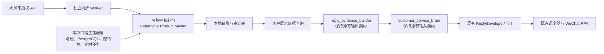

# 大风车优先商品主数据镜像改造设计

**状态：** 已确认的开发方向；本文不激活同步任务、不写入大风车，也不修改现有运行时合同。

**关联基线：**

- [客户可见回复归属基线](customer_visible_reply_ownership_baseline.md)
- [外部合同与可选插件基线](customer_service_external_contract_and_optional_plugin_baseline.md)
- [根目录开发规则](../../../AGENTS.md) 的 `Dafengche Product Master Mirror Baseline (Required)`

## 1. 决策与目标

将 `apps/wechat_ai_customer_service` 的 `product_master` 从当前的通用测试商品结构，改造为**大风车优先的车辆商品主数据镜像**。

对有大风车绑定的车辆：

1. 大风车已授权 API 的返回字段是车辆事实的权威合同。
2. 字段名、嵌套、类型、语义和空值含义原样保存，不建立第二套含义相同、名称不同的车辆字段。
3. 本地只增加大风车没有、但同步、人工经营和微信客服运行必需的附加信息。
4. 微信客服 Brain 只读取被字段策略明确批准、且满足门店范围和新鲜度要求的证据；它不直接读原始商品记录，不生成或替代客户可见措辞。

这不是把大风车 API 响应临时塞进一个缓存，也不是维护一套与大风车平行的手写商品库。产品库将成为大风车的可追溯本地镜像和受控客服检索层。

## 2. 已知边界

当前内部《大风车开放平台标准接口文档》明确覆盖的接口/字段域为：

| 数据域 | API |
| --- | --- |
| 店铺 | `com.souche.danube.portal.dubbo.open.api.ShopOpenService#getByCode` |
| 按店铺和业务阶段列车源 ID | `com.souche.danube.portal.dubbo.open.api.CarOpenService#listCarIdsByShopCodeAndOperationPhase` |
| 车辆详情 | `com.souche.danube.portal.dubbo.open.api.CarOpenService#getById` |
| 车辆图片 | `com.souche.danube.portal.dubbo.open.api.CarPictureOpenService#findByCarId` |
| 更新车辆信息 | `com.souche.danube.portal.dubbo.open.api.CarOpenService#update` |
| 查询客户信息 | 文档提供请求/响应字段表，但该章节未写明 API 名称 |
| 更新客户信息 | 文档提供 `updateParam` 字段表，但该章节未写明 API 名称 |

文档定义了 `appKey`、秒级 `timestamp`、JSON 字符串 `data` 和 `sign` 的签名请求，也要求合作商权限和环境出口 IP 白名单。实现时只使用线上 HTTPS 地址，凭据只从运行时密钥配置读取，绝不写入商品记录、测试夹具或文档。

因此当前实现边界调整为：

- 商品库镜像的自动同步仍只读，覆盖店铺、车辆 ID、车辆详情和车辆图片四个读取接口；聊天、RPA 和后台列表不会触发大风车写接口。
- 7.5 车辆更新接口只作为显式、管理员确认后的写回能力预留，不能接入自动同步或客服实时链路；写回请求必须保持官方 `updateParam` 字段形状。
- 7.6/7.7 的客户信息属于独立客户/线索域，且当前文档缺 API 名称；只能先保留字段合同和 PII 策略，不能凭字段表臆造调用方法，也不能混入车辆商品记录。
- 文档仍未提供聊天记录、增量变更回调、维修/维保/保养/出险记录等独立官方接口；不得通过 UI 抓取来伪造这些域。未来如取得官方 API、导出或 Webhook，必须作为独立域接入，并与车辆记录、客户 PII 和客服证据策略隔离。

## 3. 当前状态与改造原则

当前 `ProductMasterStore` 使用 `category_id="products"`、`id`、`status`、`source`、`data`、`runtime` 和 `metadata` 的通用商品信封；其默认字段面向普通商品，例如 `name`、`sku`、`price`、`inventory`。现有 `ProductMasterStore`、`KnowledgeBaseStore`、`KnowledgeRuntime`、管理台和测试均可能消费这些合同。

旧测试商品价值较低，但不能因为其业务价值低而静默破坏现有读取合同。改造按以下方式进行：

- 保留 `ProductMasterStore` 的既有导入路径、公开方法和旧调用的投影能力；不保留 V1 的运行时读取或写入能力。
- 所有持久化车源都使用 `schema_version: 2`。历史通用记录只能通过显式、可审计迁移转为 V2 手工车辆；V1 文件/旧数据库层是迁移隔离区，不是业务回退源。
- 通过兼容门面为旧消费者提供稳定的只读投影，不把大风车字段重命名后永久复制一份。
- 不将旧通用测试商品自动臆测为大风车车辆。它们要么归档，要么迁为 `source.type="manual"` 且 `source.marker.ingest_channel="legacy_v1_migration"` 的大风车形状手工记录，保存完整原始快照，等待人工补全或绑定。

### 3.1 架构审计与收束边界

商品主数据已有可复用的独立核心，但还不是一个完全隔离、可以无感替换的领域模块：`ProductMasterStore` 负责商品持久化和旧数据回退，而 `KnowledgeRuntime`、管理台、兼容编译器和回复证据构建器仍消费当前通用 `data.name`、`data.price`、`data.inventory` 等字段。

本改造的目标不是把大风车字段逻辑复制进这些消费者，而是把它们全部收束在商品主数据域中。责任划分如下：

| 区域 | 当前职责 | 大风车改造后的职责 | 是否允许理解大风车字段 |
| --- | --- | --- | --- |
| `product_master` 与其新增内部适配组件 | 商品持久化、校验、迁移 | 无损镜像、签名调用、同步、字段策略、人工扩展、审计、旧格式投影 | 是，唯一位置 |
| `KnowledgeRuntime` / `KnowledgeBaseStore` | 商品读取门面与分类知识集成 | 保留旧读取合同，路由到商品主数据门面 | 否 |
| 商品管理台 | 通用商品表单、人工编辑 | 展示镜像、新鲜度和受限字段；只允许本地扩展或显式覆盖 | 否，使用商品主数据提供的表单/投影 |
| `reply_evidence_builder` | 商品检索、候选排序、回复证据组装 | 只请求“客户可展示车辆证据”，不再读取或映射大风车原始字段 | 否 |
| `customer_service_brain` | 基于证据生成客户可见回复 | 只消费授权且已脱敏的证据包 | 否 |
| `KnowledgeCompiler` | 生成历史兼容产物 | 只消费商品主数据提供的兼容投影 | 否 |

因此，商品主数据域应提供两个不同的只读输出：

1. **内部镜像读取**：供管理台、审计和同步诊断使用，可按权限查看完整的授权大风车载荷。
2. **客服证据读取**：供 `reply_evidence_builder` 使用，只返回当前会话门店可见、字段策略批准、同步未过期的车辆事实和图片引用。

`reply_evidence_builder` 不得再自行从 `item.data` 拼接 `name`、`price`、`stock`；`customer_service_brain` 不得了解 `baseCarInfo`、`carPriceInfo` 等大风车字段路径；兼容编译器也不得成为第二套字段映射器。需要旧通用格式时，只由商品主数据域生成兼容投影。

现有车行业词表、脱敏规则和历史测试数据也应明确分流：

- 用于候选污染检测、隐私脱敏或模糊名称识别的通用车型词表不是商品事实源，可以保留在其现有安全/识别模块。
- `data/tenants/*/product_master` 中标记为测试夹具的具体车型、价格、库存不得作为生产权威车源；接入大风车后应归档或仅保留为回归夹具。
- 本地 `reply_style_adapter`、`customer_intent_assist` 等模块中遗留的客户可见模板不属于商品库映射；它们必须在独立的 Brain First 清理任务中处理，禁止在本改造中继续添加大风车相关模板或字段判断。

### 3.2 模块封装、可移植性与不变的运行时契约

本轮复审的结论是：**可以将改造收束为一个可整体移植的商品主数据模块，但当前的 `product_master.py` 不能原样复制给其他系统。** 它现在直接依赖本项目的租户路径、文件/数据库存储和知识库运行时。这些宿主依赖必须被移到适配层；不能把大风车同步逻辑继续散写进 `KnowledgeRuntime`、`reply_evidence_builder`、Brain、调度器或 RPA。

目标结构如下。实线表示运行时调用；大风车网络请求只发生在独立同步任务中，聊天和发送路径只读取本地镜像。



#### 3.2.1 可整体复用的包边界

实现时新增一个不依赖微信系统的核心包（建议仓库顶层 `packages/dafengche_product_master/`），其内容只包括：大风车签名客户端、同步只读客户端、显式写回客户端能力、无损镜像模型、同步编排、字段策略执行、人工记录与绑定、兼容投影和客户证据查询。包内禁止导入：

- `apps.wechat_ai_customer_service.workflows.*`；
- `admin_backend.*`、`adapters.wechat_*`、任何 RPA/OCR 代码；
- 本项目的 `knowledge_paths`、`storage`、全局配置路径或全局租户状态。

核心包通过最小宿主端口工作，而不是假定某一种数据库或某一个微信系统：

| 宿主端口 | 核心包要求 | 本项目实现位置 | 外部系统如何接入 |
| --- | --- | --- | --- |
| `MirrorRepository` | 保存、查询、审计无损镜像和人工扩展 | 文件/PostgreSQL 适配器 | 实现自己的 MySQL、MongoDB、ORM 或文件适配器 |
| `DafengcheTransport` 与密钥提供器 | 发送已签名请求，读取运行时凭据；同步任务只装配只读客户端，写回任务必须独立显式装配 | 本项目密钥/网络适配器 | 接入自己的 KMS、环境变量和 HTTP 客户端 |
| 租户/门店作用域解析器 | 把调用者限制到允许的 `tenantId + shopCode` | 微信会话—门店绑定适配器 | 绑定其账号、组织或门店模型 |
| 字段策略提供器 | 决定何时哪些字段可出现在客户证据中 | 微信客服字段策略适配器 | 配置其自身前台/API 展示策略 |
| 时钟、同步租约和任务触发器 | 计划全量同步、限流、重试与审计 | 后台 worker/定时任务适配器 | 使用自身的 cron、队列或工作流引擎 |

核心包应只对宿主暴露五类稳定能力：`sync(scope)`、`read_mirror(scope)`、`save_manual_vehicle(...)`、`bind_manual_vehicle(...)`、`build_customer_evidence(query, scope, policy)` 和 `project_legacy_record(...)`。这些是数据能力，不产生客服话术、不发送消息、不维护微信会话状态。其他用户只需实现上表端口，即可把整个包接入其自己的客服、官网、ERP 或后台系统。

本项目中保留 `apps/wechat_ai_customer_service/product_master.py` 作为旧导入路径和 `ProductMasterStore` 的兼容门面；它只装配上述宿主适配器并委托核心包，不承载第二套大风车字段映射。控制台、`KnowledgeRuntime` 和 `KnowledgeCompiler` 继续经该门面或其兼容投影访问数据。

#### 3.2.2 Brain 与 RPA 的冻结边界

大风车接入不是一次聊天链路重写。下列契约必须保持字节级/字段级兼容（新增可选诊断字段除外）：

| 组件 | 不变的输入/输出 | 允许的唯一变化 |
| --- | --- | --- |
| `reply_evidence_builder` | 保持现有商品候选函数及其写入 `knowledge.product_master.items` 的外层结构 | 候选来源改为调用商品主数据域的“客户证据查询”；返回的仍是现有通用证据投影，不含大风车原始路径 |
| `customer_service_brain` | 继续只接收授权证据包、生成既有 BrainPlan/ReplyEnvelope | 不新增大风车 API、原始 JSON、凭据、门店扫描或字段映射依赖 |
| `listen_and_reply`、`customer_service_scheduler`、守卫和最终润色 | 保持会话绑定、发送前复核、阻断和回复包合同 | 不因大风车增加本地模板、额外发送分支或跨会话状态 |
| `wechat_connector`、Win32 OCR/RPA、`approved_outbound_send` | 保持既有目标定位、文本发送、确认和审计输入 | 不导入商品主数据模块，不请求大风车，不理解车辆字段 |

因此聊天实时路径为“本地证据查询 → 既有证据包 → Brain → 既有守卫/ReplyEnvelope → 既有 RPA”。同步 worker 与聊天/RPA worker 独立部署、独立失败；同步失败只影响证据新鲜度和是否阻断车辆事实，绝不改变 RPA 的操作方式或使其直连大风车。

#### 3.2.3 强制隔离测试

实现阶段除既有商品库回归外，新增以下不可省略的测试：

1. **可移植烟测**：把核心包加载到临时最小宿主，使用内存 `MirrorRepository`、伪 HTTP 响应和伪时钟完成同步、手工录入、绑定和证据查询；测试进程不安装或导入微信、PostgreSQL、控制台组件。
2. **反向依赖静态检查**：核心包不得导入 `workflows`、`admin_backend`、`adapters`、`knowledge_paths`、`storage`；RPA/OCR 物理适配器不得新增对大风车核心包的导入。
3. **Brain 金样回放**：以改造前同一份 `knowledge.product_master.items` 证据夹具输入，断言 BrainPlan、权威来源、阻断/修订语义和客户可见回复所有既有合同不变；另测大风车原始字段绝不会泄漏进该输入。
4. **RPA 金样回放**：以改造前 ReplyEnvelope/会话账本夹具运行目标确认、发送前复核和多会话隔离；断言发送适配器收到的目标、文本和会话字段完全不受商品来源影响。
5. **离线容错**：停用大风车凭据、模拟上游超时或同步失败后，Brain/RPA 仍可按原流程处理不依赖实时车源的会话；需要车辆实时事实时只执行既有 Brain 阻断/转人工路径，不产生本地替代话术。

## 4. 目标记录合同

产品信封是本地运行所需的容器；大风车字段本身位于 `source_payloads` 中并保持原样。以下是结构示意，不是虚构的大风车业务字段清单：

```json
{
  "schema_version": 2,
  "category_id": "products",
  "id": "pmv_01...",
  "status": "active",
  "source": {
    "type": "dafengche",
    "provider": "dafengche",
    "marker": {
      "ingest_channel": "dafengche_api",
      "original_source_type": "dafengche",
      "recorded_at": "2026-07-13T09:30:00+00:00"
    },
    "binding": {
      "shopCode": "<大风车原值>",
      "carId": "<大风车原值>",
      "state": "bound"
    }
  },
  "source_payloads": {
    "vehicle_detail": {
      "api": "com.souche.danube.portal.dubbo.open.api.CarOpenService#getById",
      "payload": {
        "carId": "<原值>",
        "shopCode": "<原值>",
        "operationPhase": "<原值>",
        "baseCarInfo": {},
        "carModelParam": {},
        "carPriceInfo": {},
        "carLicenseInfo": {}
      },
      "pulled_at": "2026-07-13T00:00:00+08:00",
      "content_hash": "sha256:<hash>"
    },
    "vehicle_pictures": {
      "api": "com.souche.danube.portal.dubbo.open.api.CarPictureOpenService#findByCarId",
      "payload": [],
      "pulled_at": "2026-07-13T00:00:00+08:00",
      "content_hash": "sha256:<hash>"
    }
  },
  "extensions": {
    "wechat_customer_service": {
      "manual_annotations": {},
      "manual_overrides": {}
    }
  },
  "runtime": {},
  "metadata": {}
}
```

`source_payloads.*.payload` 的内部字段必须逐项保真：例如车辆详情的 `baseCarInfo`、`carModelParam`、`carPriceInfo`、`carLicenseInfo` 以及图片接口的每个图片对象，均不得改名或改变嵌套位置。该结构还必须保留文档未来返回但当前应用尚未认识的字段。

店铺响应和“按门店/业务阶段列车源 ID”响应属于一次同步批次的作用域证据，不重复复制到每一辆车记录中；它们必须连同 `operationPhase`、拉取时间和哈希完整写入内部同步审计。审计同样不是客户证据，不能被 Brain 或 RPA 读取。

本地信封和扩展字段的职责仅限于：

| 字段/域 | 用途 | 是否替代大风车字段 |
| --- | --- | --- |
| `id` | 本地稳定主键，支持手工车辆和跨存储引用 | 否 |
| `source.binding` | 标记 `shopCode`、`carId` 和绑定状态 | 否 |
| `pulled_at`、`content_hash`、同步批次 | 新鲜度、差异同步和审计 | 否 |
| `manual_annotations` | 营销备注、检索标签等大风车没有的补充 | 否 |
| `manual_overrides` | 明确、逐字段、可撤销的例外 | 否；仅在策略允许时覆盖展示投影 |
| 字段策略 | 控制 Brain 是否可读取字段 | 否 |

人工新建车辆同样采用大风车形状：`source.type="manual"`、`binding.state="unbound"`，并在 `source_payloads.vehicle_detail.payload` 中填写适用的大风车字段路径。人工字段的每个值必须带来源和操作审计。之后发现对应大风车车辆时，只有管理员显式确认的 `carId + shopCode` 绑定才能合并；不能依赖车型、VIN 或名称的模糊自动合并。

无论来源类型，`source.marker` 都是必填的可追溯标记，至少有 `ingest_channel`、`original_source_type` 和 `recorded_at`。大风车同步使用 `dafengche_api`，日常后台录入使用 `manual_input`，历史 V1 记录转换使用 `legacy_v1_migration`；后者仍是手工记录，绝不能伪装成大风车 API 已确认的车源。该标记服务于审计、差异更新和排障，不是客户可见证据。

### 4.1 V1 退役规则

V1 不再是商品库的持久化、查询或 Brain 输入格式：`ProductMasterStore.save_item()` 收到旧通用表单结构时，会在写入边界转换为 V2 `manual` 车源；`list_items()`、`get_item()`、`KnowledgeRuntime` 和客户证据门面只读取 V2。旧文件、旧数据库层和 V1 快照只能由显式迁移工具读取。为保护已冻结的调用合同，可以在内存中从 V2 生成旧形状投影，但该投影不能落盘、不能成为回退源，也不含大风车原始 payload。

### 4.2 当前历史商品库去留

截至 2026-07-28 的只读审计结果：

- `chejin/product_master/items` 下有 22 条 V2 手工车辆，全部是 `source.type="manual"`、`source.marker.ingest_channel="legacy_v1_migration"`、`binding.state="unbound"`。
- `default/product_master/items` 下仍有一批历史迁移商品，其中包含非车类测试商品；`chejin_usedcar_regression` 下是回归夹具，来源标记为 `test_fixture`。
- 当前仓库内未发现已绑定 `source.type="dafengche"` 的正式大风车镜像车源。

处理原则：

1. `chejin` 的 22 条历史车辆有保留价值，但只能作为手工补充/迁移快照/回归对照；它们不能被标记成大风车同步车，也不能声称实时在售。
2. 接入正式大风车同步后，如果同一车辆存在官方 `shopCode + carId`，必须由管理员显式确认绑定；确认前不做模糊自动合并。
3. 官方同步覆盖的同名/同款车辆，以大风车镜像为权威事实；历史手工记录只保留不重叠的营销注释、别名、客服补充说明和审计快照。
4. `default` 下的非车类测试商品不应进入车商生产客服；保留为通用商品库回归夹具即可。
5. 不物理删除历史商品库文件。需要退出生产检索时，使用 `archived` 或迁移审计标记，而不是删除源记录。

## 5. 字段策略与 Brain 证据边界

完整保存在产品库中不表示可提供给 Brain。另建独立、可版本化的字段路径策略，例如：

```json
{
  "source": "dafengche",
  "path": "source_payloads.vehicle_detail.payload.carPriceInfo.salePrice",
  "classification": "customer_visible",
  "brain_available": true,
  "requires_freshness": true
}
```

初始策略遵循最小披露：

- 可按业务规则授权：品牌/车系/车型、首次上牌、表显里程、车况、颜色、配置、可用图片、可售业务阶段和网络标价 `carPriceInfo.salePrice`。
- 默认仅内部使用：采购价 `purchasePrice`、销售底价 `salesPrice`、经理底价 `managerPrice`、批发价 `wholesalePrice`、成交价 `dealPrice` 等非公开经营价格。
- 默认严格限制：VIN `baseCarInfo.vinNumber`、车牌 `baseCarInfo.plateNumber`、负责人/创建人/组织内部标识及其他个人或内部经营信息。

证据检索服务必须在读取前同时验证：会话所属租户和门店、车辆 `operationPhase`、字段策略、同步新鲜度、人工覆盖是否仍有效。它输出带来源与更新时间的证据包，不输出原始整条 JSON；`customer_service_brain` 据此生成回复。守卫发现价格、库存或会话绑定冲突时，只能反馈 Brain 修订或阻断发送，不能自行拼出客户回复。

## 6. 同步与冲突规则

### 6.1 同步顺序

1. 读取已配置的店铺信息，并确认租户/门店作用域。
2. 对每个经授权的 `operationPhase` 调用车源 ID 列表接口。
3. 对每个 `carId` 拉取车辆详情和图片，并完整写入相应 API 的原始载荷。
4. 计算载荷哈希；未变化则只更新同步观测，变化则写入新版本和审计事件。
5. 未再出现在可售范围内的车辆不得物理删除；按来源状态记录退役/售出/未知，直到业务规则确认其含义。

当前文档未提供业务阶段枚举、分页语义、更新时间字段或增量 Webhook。实现前必须由大风车业务方提供这些约束；在此之前使用可配置的阶段清单和限流保护的全量扫描，不得猜测状态含义。

### 6.2 权威与人工覆盖

| 场景 | 结果 |
| --- | --- |
| 已绑定车辆的大风车字段发生变化 | 更新镜像字段，记录旧值和同步批次 |
| 人工补充大风车不存在的营销字段 | 保留在 `extensions`，不影响镜像 |
| 人工试图改写绑定车辆的同名大风车事实 | 仅通过显式、逐字段、可撤销的 `manual_overrides` 处理 |
| 手工车辆尚未绑定 | 手工值可用，但证据必须标明手工来源和新鲜度 |
| 发现疑似同车 | 等待人工确认绑定，不自动合并 |
| 同步失败或数据过期 | 保留最后有效镜像，但禁止将其表述为当前实时在售事实 |

当前文档已有车辆更新接口，但同步器仍必须只读；管理台对绑定大风车车辆的“编辑”默认只允许编辑本地扩展或创建人工覆盖，不得假装已回写大风车。只有在宿主显式启用、管理员确认、审计和权限校验都完成后，才能由独立写回流程调用 `CarOpenService#update`。

## 7. 实施阶段

### 阶段 A：合同与夹具

1. 为四个已知 API 建立脱敏、完整的响应夹具。
2. 定义 `schema_version: 2` 的镜像信封、字段策略格式和兼容投影合同。
3. 为未知字段保留、字段路径保真、空值保真、旧 `schema_version: 1` 读取增加特征测试。

### 阶段 B：只读大风车连接器

1. 增加隔离的连接器配置、签名器、IP/权限前置检查和限流处理。
2. 实现店铺、车源 ID、车辆详情、图片的只读拉取。
3. 实现可重放的同步批次、哈希差异和失败审计；不发送任何写请求。

### 阶段 C：商品主库与管理台

1. `ProductMasterStore` 保持原公开门面，在内部识别 v1 与 v2 记录。
2. 管理台新增大风车镜像浏览、同步状态、受限字段标识、人工扩展和人工覆盖审计。
3. 旧通用测试商品先归档或标记 `manual_legacy`，不污染大风车可售车源检索。

### 阶段 D：客服证据接入

1. 根据字段策略、门店和新鲜度从 v2 记录构建证据包。
2. 将证据包作为 Brain 输入的授权产品事实，而不是本地模板输入。
3. 启用价格/库存冲突反馈、过期阻断、多会话不串车源和审计追溯。

### 阶段 E：后续 CRM 域

仅在拿到客户/线索接口的官方 API 名称、权限和调用语义后，按同样的无损镜像原则新增客户/线索独立存储、PII 策略和会话绑定；不得为了“账号功能已开通”而复用车辆表或抓取 UI。

### 7.1 已完成的首个可执行切片（不含生产连接）

以下首个切片已经落入代码，用于锁定模块边界并提供后续生产接入的可靠基础；它不携带真实凭据，不发起真实网络请求，也不会自行注册定时任务：

| 产物 | 职责 | 明确不做的事 |
| --- | --- | --- |
| `packages/dafengche_product_master/` | 可复制的无宿主核心包：签名客户端、同步只读客户端、显式车辆写回客户端、v2 无损镜像、人工车辆、内存仓储端口、字段策略和客户证据投影 | 不导入微信、Brain、RPA、管理后台、项目路径或数据库驱动；不把写回接入自动同步 |
| `dafengche_product_master_host_adapter.py` | 把现有 `ProductMasterStore` 适配为核心包的仓储端口，并保存内部同步审计 | 不解析大风车字段、不管理凭据、不写回复、不调度 RPA |
| `product_master.py` | 在原有公开门面上新增客户证据读取方法；v1 原样兼容，v2 仅返回安全投影 | 不修改既有导入路径、旧方法或旧记录格式 |
| `KnowledgeRuntime` / `reply_evidence_builder` | 经单一客户证据门面获取商品候选；显式透传会话中的 `shopCode` | 不读取 `source_payloads`，不解析大风车字段，不调用上游 API |
| `tests/fixtures/dafengche/` 与 `run_dafengche_product_master_checks.py` | 脱敏读取接口夹具、车辆写回合同、客户字段域占位、签名、无损保留、脱敏、过期、跨店、手工录入、兼容、Brain/RPA 边界回归 | 不包含真实账号、密钥、车主、客户或真实 VIN/车牌；不臆造客户 API 名称 |

生产接入仍需由宿主提供：密钥提供器、已白名单的 HTTP 传输器、`tenantId + shopCode` 会话绑定、持久化审计/同步调度和字段策略配置。未提供这些端口时，核心包只能被测试或管理工具显式调用；它不会影响原有客服、Brain 或 RPA 的启动。

## 8. 验收与回归矩阵

- 大风车详情和图片夹具中的每个字段、嵌套和空值均可原样读回；新字段不会被丢弃。
- `shopCode + carId` 绑定唯一且租户/门店隔离；任一会话都不能检索到其他门店车源。
- 大风车更新会改变镜像和审计记录，但不会覆盖不重叠的人工注释。
- 手工车辆能够使用同一大风车形状保存；未确认绑定不能合并到大风车车源。
- 旧 `ProductMasterStore` 导入路径、读取方法、旧文件记录和既有 `run_product_master_split_checks.py` 均继续通过。
- Brain 证据包不含 VIN、车牌、内部身份或默认受限价格；客户可见字段必须同时通过策略和新鲜度检查。
- `429`、签名过期、IP/权限拒绝、上游错误和同步中断不会制造“实时有车”的虚假事实，也不会触发本地客户可见回复。
- 不配置大风车凭据或连接器失败时，原有核心、手工商品记录及其他可选能力仍可启动和工作。
- `run_dafengche_product_master_checks.py` 必须覆盖：四接口夹具、签名、未知字段/空值保留、VIN/车牌/内部价格过滤、过期阻断、显式门店隔离、人工 v2 记录、旧 v1 兼容、Brain 证据字段兼容和 RPA 反向依赖；`run_product_master_split_checks.py` 与 Brain 合同回归必须继续通过。

## 9. 不在本次改造中做的事情

- 不使用大风车 UI 逆向或抓取未授权数据。
- 不将内部价格、VIN、车牌或员工数据直接暴露给 Brain 或客户。
- 不用确定性模板替代 Brain 生成客户回复。
- 不删除旧商品库文件、旧读取入口或现有公共字段。
- 不启用任何自动大风车写回、客户/线索同步或生产凭据配置，直到相应官方合同、授权、操作审计和回滚策略到位。
