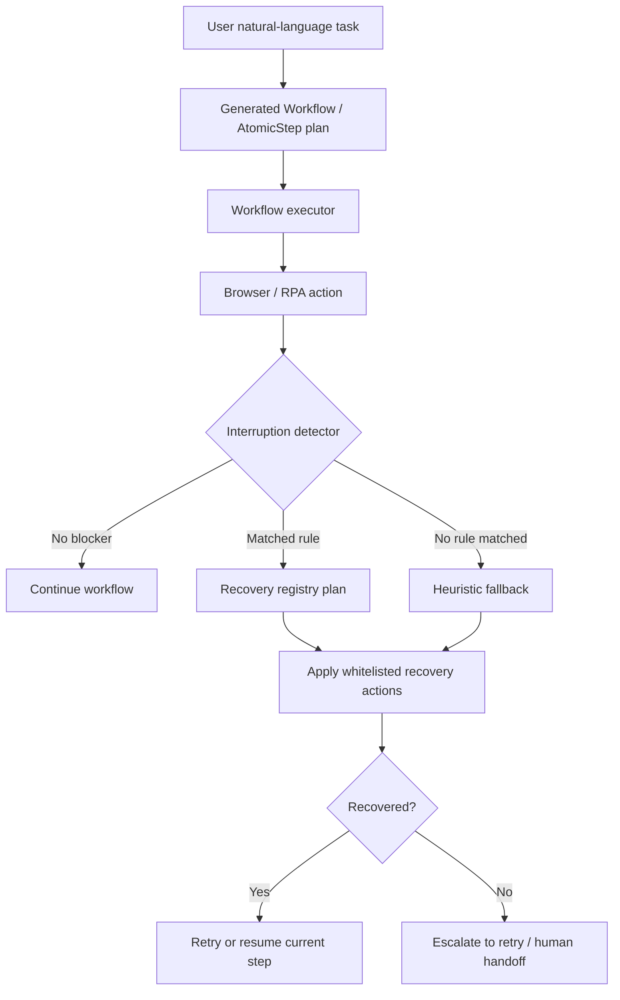

# Exception Recovery Layer Architecture

## Problem

The original execution model was intentionally deterministic:

`natural language -> workflow generation -> AtomicStep execution -> RPA engine`

That keeps token usage low and makes replay/debugging easier, but it has a practical weakness:
unexpected UI interruptions can break an otherwise valid flow.

Typical examples:

1. Service agreement checkboxes that must be acknowledged before login or submission.
2. Cookie/privacy banners that cover the page and intercept clicks.
3. Notice dialogs, permission prompts, "later" popups, and lightweight overlays.
4. Temporary focus-stealing or page-state mismatches where retrying the same step would work if the blocker were cleared first.

Without a recovery layer, the system stops and waits for a human or a brand-new AI instruction.

## Design Goal

Add a small amount of adaptive behavior without turning runtime execution into an open-ended AI agent.

The target model is:

`deterministic workflow + deterministic recovery packs + constrained fallback`

This keeps the main path stable while giving the runtime enough flexibility to survive common interruptions.

## Design Principles

1. Keep the happy path deterministic.
2. Detect interruptions before and after important browser actions.
3. Prefer reusable rule packs over runtime free-form reasoning.
4. Restrict fallback behavior to low-risk, whitelisted actions.
5. Record every recovery event so later debugging is cheap.
6. Recover in place and continue the current step instead of restarting the whole task.

## Runtime Flow

## Implemented Modules

The recovery layer lives in:

`D:\AI\AI_RPA\src\omniauto\recovery\`

### `models.py`

Structured payloads for recovery snapshots, plans, actions, and attempt results.

### `policy.py`

Defines the action whitelist and cycle limits. The current low-risk whitelist is:

1. `click_text`
2. `click_selector`
3. `check_text`
4. `press_key`
5. `wait`

### `registry.py`

Rule-based recovery registry. This is the main low-token recovery engine.

Default rules currently cover:

1. Agreement/privacy checkbox blockers
2. Cookie/privacy consent banners
3. Closeable overlays
4. Lightweight notice/permission dialogs

### `fallback.py`

A constrained heuristic fallback used only when no registry rule matches.

It does not generate code and does not invent new goals.
It only proposes whitelisted actions based on the current page snapshot.

### `manager.py`

The runtime coordinator that:

1. Collects a structured browser snapshot
2. Matches registry rules
3. Invokes the constrained fallback if needed
4. Executes recovery actions
5. Returns a machine-readable recovery result

## Integration Points

### Browser engine integration

`D:\AI\AI_RPA\src\omniauto\engines\browser.py`

The browser engine now performs interruption recovery:

1. Before navigation
2. After navigation
3. Before click/type/extract/wait operations
4. After click/type operations
5. When click/type/wait operations fail

This means browser-side interruptions can often be cleared automatically before the workflow decides a step has failed.

### Workflow integration

`D:\AI\AI_RPA\src\omniauto\core\state_machine.py`

The workflow executor now attempts recovery:

1. Before a step starts
2. After a step succeeds
3. When a step returns `FAILED`
4. When a step reaches `ESCALATED`

If recovery succeeds, the workflow retries the current step instead of forcing the whole task to stop.

Recovery events are written into:

`context.metadata["recovery_events"]`

## Why this approach is low-token

This upgrade is intentionally not "let the LLM drive the UI in real time."

Most interruptions are handled by:

1. DOM snapshot extraction
2. Keyword/rule matching
3. Whitelisted deterministic actions

Only the fallback layer adds limited adaptiveness, and even that layer is still deterministic code rather than an unconstrained LLM loop.

## Why this approach resists hallucination

The runtime is not allowed to invent arbitrary new behavior.

It can only:

1. Observe a compact snapshot
2. Match a known rule or low-risk heuristic
3. Execute actions from a small safe set

That sharply limits bad decisions compared with a runtime AI agent that is free to "figure something out" step by step.

## Extension Strategy

When adding recovery for a new product or site, do not change the global executor first.
Start by adding a new recovery rule pack.

Recommended order:

1. Identify the interruption signature
2. Add a matcher that is narrow and explainable
3. Add a small plan using whitelisted actions
4. Add a focused regression test
5. Only expand the whitelist if a real blocker cannot be solved otherwise

## Recommended Future Phase

If we later need an even smarter fallback, the next step should be:

`structured snapshot -> tiny classifier -> choose action from whitelist`

Not:

`runtime LLM free-form browser control`

That preserves the same safety and cost model while adding one more layer of adaptiveness.
